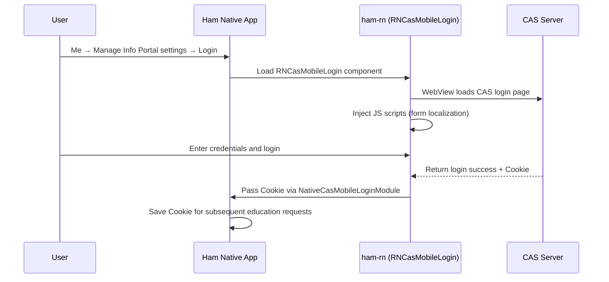

# CAS Authentication Module

## User Entry Point

Users trigger CAS login in the Ham app via:

**Me → Manage Info Portal settings → Login / Re-login**

When using education features (course query, grade query, etc.) for the first time without a portal login, the app guides users to the CAS login page.

## Features

CAS (Central Authentication Service) is the university's unified identity authentication system. The Ham React Native Components CAS module handles:

1. Loading the university CAS login page via WebView
2. Injecting custom JavaScript scripts for login form localization (multi-language support)
3. Intercepting cookies after successful login
4. Passing cookies back to the native side for subsequent education system requests

## Registered Entry

| Registration Name | Type | Description |
| --- | --- | --- |
| `RNCasMobileLogin` | Component | CAS mobile login view |

## Code Structure

### Business Logic (`business/cas`)

* `api.ts` — CAS authentication API wrapper, handles HTTP interactions with the CAS server
* `index.ts` — Module exports

### UI Components (`components/cas`)

* `CasMobileLoginView.tsx` — CAS mobile login interface, WebView-based

## Workflow

## Related Native Modules

| Module | Description |
| --- | --- |
| `NativeCasModule` | Request saved CAS Cookie |
| `NativeCasMobileLoginModule` | Receive login success callback (student ID, password, Cookie) |
