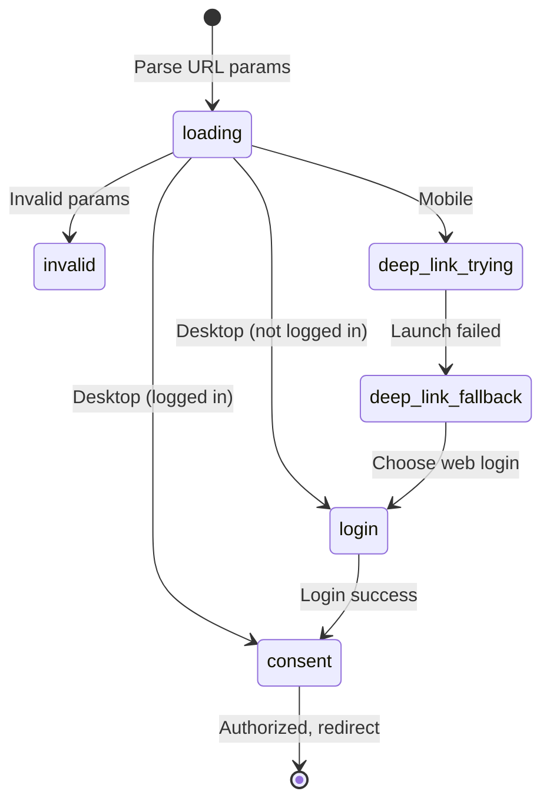
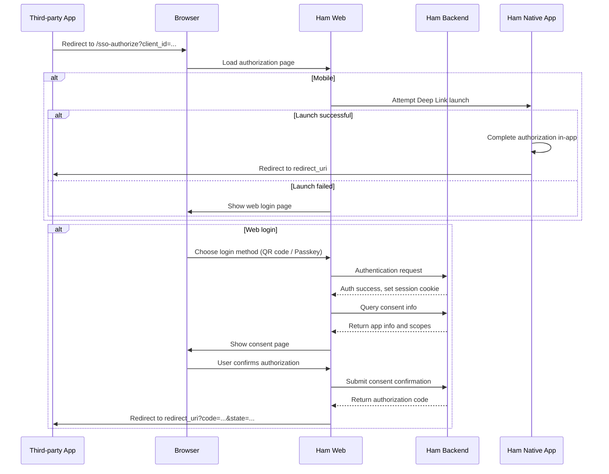

# SSO OAuth2 Authorization

## User Entry Point

When third-party apps initiate OAuth2 authorization through the Ham Connect platform, users are redirected to Ham Web's `/sso-authorize` page.

The page behavior depends on the user's device and login status:

* **Mobile**: Attempts to launch the Ham native app via `ham://sso-authorize?...` Deep Link first. Falls back to web login if the launch fails
* **Desktop**: Displays the web login page directly

## Features

The SSO OAuth2 authorization page handles the following flow:

1. Parse URL parameters (`client_id`, `scope`, `redirect_uri`, `state`)
2. Detect device type (mobile / desktop)
3. Attempt Deep Link launch on mobile
4. If web login is needed, provide the following login methods:
   * **QR Code Login** — Scan with the Ham app to log in
   * **Passkey Login** — Passwordless login via WebAuthn / Passkey
5. After login, display the consent page (showing third-party app info and requested scopes)
6. After user confirms, redirect back to the third-party app's `redirect_uri` with an authorization code

## Page Stages

The page uses Jotai state management and transitions through the following stages:

| Stage | Description |
| --- | --- |
| `loading` | Parsing URL parameters, detecting device type |
| `invalid` | Invalid URL parameters, showing error page |
| `deep-link-trying` | Attempting to launch the Ham native app |
| `deep-link-fallback` | Launch failed, offering app install links and web login options |
| `login` | Web login page (QR code / Passkey) |
| `consent` | Authorization consent page |

## Code Structure

### Page Components (`app/sso-authorize/`)

* `page.client.tsx` — Main page component, handles stage transitions and Deep Link logic
* `store.ts` — Jotai state atoms (URL params, page stage, Deep Link URL)
* `LoginView.tsx` — Login view (QR code + Passkey tabs)
* `ConsentView.tsx` — Authorization consent view
* `DeepLinkTrying.tsx` — Deep Link attempt view
* `DeepLinkFallback.tsx` — Deep Link fallback view
* `HeaderBar.tsx` — Page header bar
* `InvalidRequestView.tsx` — Invalid request view

### Service Layer (`services/sso/`)

* `api.ts` — SSO API wrapper (QR login, Passkey login, session management, consent)
* `deepLink.ts` — Deep Link construction and launch logic
* `ua.ts` — Device type detection (mobile / desktop)

### API Routes (`app/api/`)

* `auth/qr/ticket/` — QR login ticket creation and polling
* `auth/passkey/` — Passkey login (get options, verify assertion)
* `auth/me/` — Get current logged-in user info
* `auth/logout/` — Logout
* `auth/refresh/` — Refresh session
* `sso/consent/info/` — Get consent info (third-party app name, scope descriptions)
* `sso/consent/confirm/` — Confirm authorization, return authorization code

## Workflow

## Session Management

The authorization page implements a visibility-aware session refresh mechanism:

* While on the consent stage, listens for `visibilitychange` events
* Each time the page returns to the foreground, calls `/auth/refresh` to renew the session cookie
* If the session has expired (401), automatically redirects the user back to the login stage
