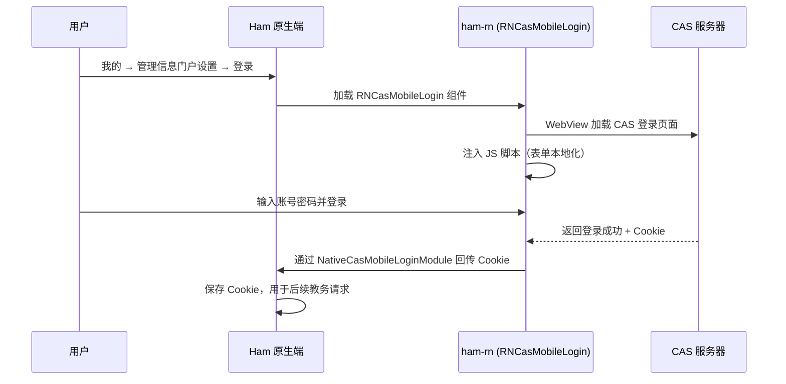

# CAS 认证模块

## 用户操作入口

用户在 Ham 应用中通过以下路径触发 CAS 登录：

**我的 → 管理信息门户设置 → 登录 / 重新登录**

首次使用教务相关功能（课程查询、成绩查询等）时，如果尚未登录信息门户，应用会引导用户前往 CAS 登录页面。

## 功能说明

CAS（Central Authentication Service）是学校的统一身份认证系统。Ham React Native组件的 CAS 模块负责：

1. 通过 WebView 加载学校 CAS 登录页面
2. 注入自定义 JavaScript 脚本，实现登录表单的本地化（多语言适配）
3. 拦截登录成功后的 Cookie
4. 将 Cookie 回传给原生端，供后续教务系统请求使用

## 注册入口

| 注册名 | 类型 | 说明 |
| --- | --- | --- |
| `RNCasMobileLogin` | 组件 | CAS 移动端登录视图 |

## 代码结构

### 业务逻辑 (`business/cas`)

- `api.ts` — CAS 认证 API 封装，处理与 CAS 服务器的 HTTP 交互
- `index.ts` — 模块导出

### UI 组件 (`components/cas`)

- `CasMobileLoginView.tsx` — CAS 移动端登录界面，基于 WebView 实现

## 工作流程

## 相关原生模块

| 模块 | 说明 |
| --- | --- |
| `NativeCasModule` | 请求已保存的 CAS Cookie |
| `NativeCasMobileLoginModule` | 接收登录成功回调（学号、密码、Cookie） |
