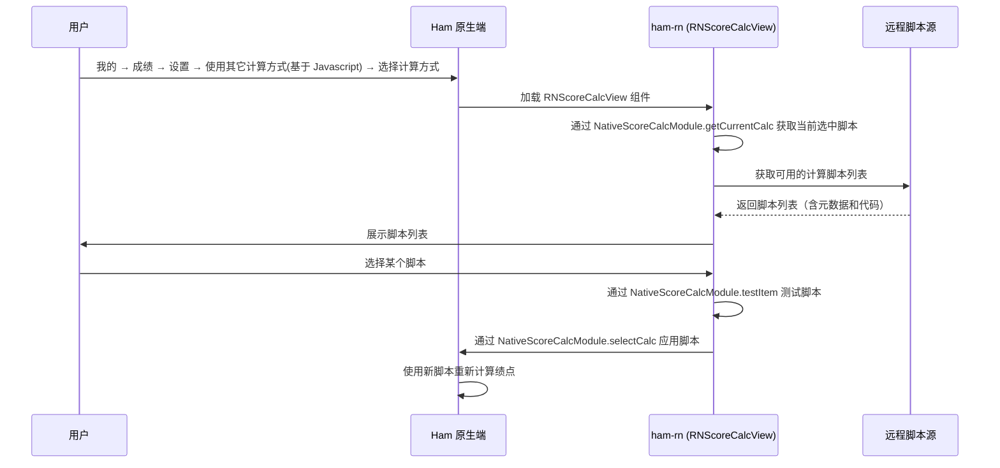

# 绩点计算模块

## 用户操作入口

**我的 → 成绩 → 设置 → F2 计算方式 → 使用其它计算方式(基于 Javascript) → 选择计算方式**

用户在「我的」页面进入成绩，点击设置，在「F2 计算方式」中选择「使用其它计算方式(基于 Javascript)」，然后点击「选择计算方式」，进入绩点计算脚本选择页面，该页面由 Ham React Native组件渲染。

## 功能说明

绩点计算模块提供基于 JavaScript 的自定义 GPA / 加权成绩计算功能。用户可以：

1. 浏览可用的计算脚本列表（来自 GitHub 等来源）
2. 选择并应用某个计算脚本
3. 查看脚本详情（作者、版本、更新说明等）
4. 测试脚本是否能正常运行

## 注册入口

| 注册名 | 类型 | 说明 |
| --- | --- | --- |
| `RNScoreCalcView` | 组件 | 绩点计算脚本选择视图 |

## 代码结构

### 业务逻辑 (`business/education/scorecalc`)

- `fetch.ts` — 从远程获取可用的计算脚本列表
- `type.ts` — 类型定义（计算脚本的元数据结构）

### UI 组件 (`components/scorecalc`)

- `ScoreCalcView.tsx` — 绩点计算主视图，包含以下子组件：
  - 当前绩点卡片 — 显示当前选中的计算方式
  - 描述单元格 — 展示脚本的简介和更新说明
  - 开发者卡片 — 显示脚本作者信息
  - GitHub 跳转卡片 — 链接到脚本的 GitHub 仓库

## 工作流程



## 计算脚本格式

计算脚本是一个 JavaScript 函数，接收成绩列表 JSON 字符串和用户信息 JSON 字符串，返回一个数组：

```javascript
/**
 * @param {string} scoreListJson - 成绩列表 JSON 字符串
 * @param {string} userInfoJson - 用户信息 JSON 字符串
 * @returns {[number, string[]]} - [计算结果, 选中的课程ID列表]
 */
function calc(scoreListJson, userInfoJson) {
    const scoreList = JSON.parse(scoreListJson);
    const userInfo = JSON.parse(userInfoJson);
    // 自定义计算逻辑
    return [score, selectedCourseIds];
}
```

## 如何新增计算方式

### 第一步：创建计算脚本

在 `src/business/education/scorecalc/embed/` 目录下新建一个 `.ts` 文件，使用 `defineEmbed` 函数定义计算逻辑：

```typescript
import {defineEmbed} from '@/business/education/scorecalc/defineEmbed';

defineEmbed((scoreList, userInfo) => {
  // scoreList: ScoreJsItem[] — 成绩列表
  // userInfo: UserInfo — 用户信息

  // 在此编写你的计算逻辑
  let totalWeighted = 0;
  let totalCredit = 0;
  const selectedIds: string[] = [];

  for (const item of scoreList) {
    totalWeighted += item.credit * item.score;
    totalCredit += item.credit;
    selectedIds.push(item.courseId);
  }

  const result = totalCredit > 0 ? totalWeighted / totalCredit : 0;

  // 返回 [计算结果, 参与计算的课程ID列表]
  return [result, selectedIds];
});
```

### 第二步：了解可用字段

`scoreList` 中每个元素（`ScoreJsItem`）包含以下字段：

| 字段 | 类型 | 说明 |
| --- | --- | --- |
| `courseType` | `string` | 课程类别（如 "公共基础必修"） |
| `name` | `string` | 课程名称（如 "高等数学"） |
| `credit` | `number` | 学分 |
| `courseCollege` | `string` | 开课学院 |
| `instructor` | `string` | 授课教师 |
| `score` | `number` | 成绩（数值） |
| `courseId` | `string` | 课程唯一标识 |

`userInfo`（`UserInfo`）包含以下字段：

| 字段 | 类型 | 说明 |
| --- | --- | --- |
| `userCollege` | `string` | 用户所在学院（如 "计算机学院"） |

### 第三步：注册脚本

在 `src/business/education/scorecalc/fetch.ts` 的 `fetchScoreCalcFromLocal` 函数中添加新条目：

```typescript
import newScript from './embed/generated/your-script.generated';

const fetchScoreCalcFromLocal = (): Array<ScoreCalcItem> => {
  return [
    // ... 已有条目
    {
      title: '你的计算方式名称',
      date: '2026-01-01',
      author: '作者名',
      version: 1,
      brief: '简短描述',
      updateBrief: '更新说明',
      desc: '详细描述',
      type: 'APP',
      url: 'https://raw.githubusercontent.com/whu-ham/ham-rn/main/src/business/education/scorecalc/embed/your-script.ts',
      script: newScript,
    },
  ];
};
```

### 注意事项

- `defineEmbed` 会将你的计算函数注册到 `globalThis.calc`，供原生端 JavaScriptCore 调用。
- 返回值必须是 `[number, string[]]` 格式，第一个元素是计算结果，第二个元素是参与计算的课程 ID 列表。
- `embed/` 目录下的 `.ts` 文件会在构建时生成对应的 `.generated` 文件，供 `fetch.ts` 导入。
- 你可以根据 `courseType` 字段筛选必修/选修课程，或根据 `userCollege` 实现学院特定的计算逻辑。

## 相关原生模块

| 模块 | 说明 |
| --- | --- |
| `NativeScoreCalcModule` | 绩点计算脚本管理（获取当前脚本 / 选择脚本 / 查看详情 / 测试脚本） |
