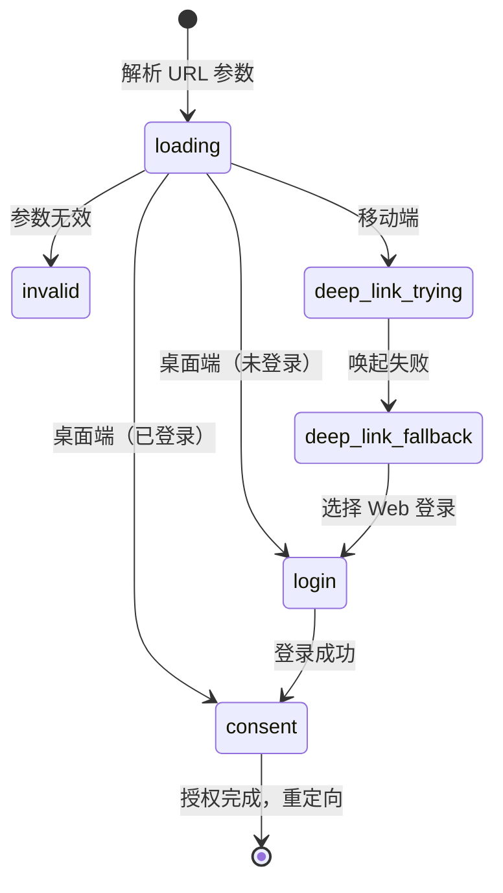
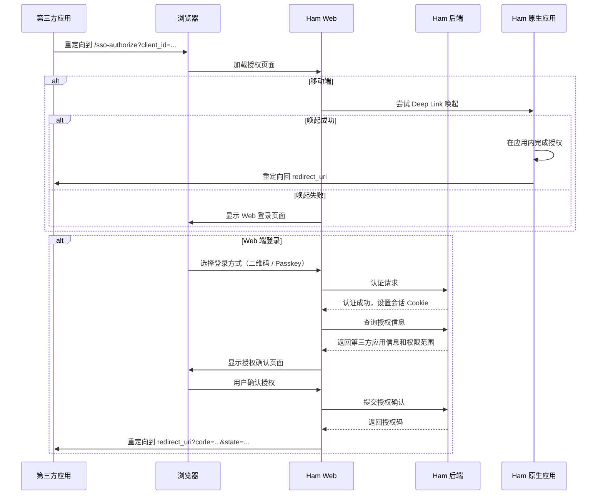

# SSO OAuth2 授权

## 用户操作入口

当第三方应用通过 Ham 互联平台发起 OAuth2 授权时，用户会被重定向到 Ham Web 的 `/sso-authorize` 页面。

该页面的行为取决于用户的设备和登录状态：

- **移动端**：优先尝试通过 `ham://sso-authorize?...` Deep Link 唤起 Ham 原生应用完成授权。如果唤起失败，则回退到 Web 端登录
- **桌面端**：直接在 Web 端展示登录页面

## 功能说明

SSO OAuth2 授权页面负责完成以下流程：

1. 解析 URL 参数（`client_id`、`scope`、`redirect_uri`、`state`）
2. 检测设备类型（移动端 / 桌面端）
3. 移动端尝试 Deep Link 唤起原生应用
4. 如果需要 Web 端登录，提供以下登录方式：
   - **二维码登录** — 使用 Ham 应用扫码完成登录
   - **Passkey 登录** — 使用 WebAuthn / Passkey 无密码登录
5. 登录成功后展示授权确认页面（显示第三方应用信息和请求的权限范围）
6. 用户确认授权后，携带授权码重定向回第三方应用的 `redirect_uri`

## 页面阶段

页面通过 Jotai 状态管理，按以下阶段流转：

| 阶段 | 说明 |
| --- | --- |
| `loading` | 解析 URL 参数，检测设备类型 |
| `invalid` | URL 参数无效，显示错误页面 |
| `deep-link-trying` | 正在尝试唤起 Ham 原生应用 |
| `deep-link-fallback` | 唤起失败，提供应用安装链接和 Web 登录选项 |
| `login` | Web 端登录页面（二维码 / Passkey） |
| `consent` | 授权确认页面 |

## 代码结构

### 页面组件 (`app/sso-authorize/`)

- `page.client.tsx` — 页面主组件，负责阶段流转和 Deep Link 逻辑
- `store.ts` — Jotai 状态原子（URL 参数、页面阶段、Deep Link URL）
- `LoginView.tsx` — 登录视图（二维码 + Passkey 标签页）
- `ConsentView.tsx` — 授权确认视图
- `DeepLinkTrying.tsx` — Deep Link 尝试中视图
- `DeepLinkFallback.tsx` — Deep Link 失败回退视图
- `HeaderBar.tsx` — 页面顶部栏
- `InvalidRequestView.tsx` — 无效请求视图

### 服务层 (`services/sso/`)

- `api.ts` — SSO 相关 API 封装（二维码登录、Passkey 登录、会话管理、授权确认）
- `deepLink.ts` — Deep Link 构建与唤起逻辑
- `ua.ts` — 设备类型检测（移动端 / 桌面端）

### API 路由 (`app/api/`)

- `auth/qr/ticket/` — 二维码登录票据创建与查询
- `auth/passkey/` — Passkey 登录（获取选项、验证断言）
- `auth/me/` — 获取当前登录用户信息
- `auth/logout/` — 登出
- `auth/refresh/` — 刷新会话
- `sso/consent/info/` — 获取授权信息（第三方应用名称、权限范围描述）
- `sso/consent/confirm/` — 确认授权，返回授权码

## 工作流程

## 会话管理

授权页面实现了可见性感知的会话刷新机制：

- 当页面处于授权确认阶段时，监听 `visibilitychange` 事件
- 每次页面从后台恢复到前台时，调用 `/auth/refresh` 刷新会话 Cookie
- 如果会话已过期（401），自动将用户重定向回登录阶段
