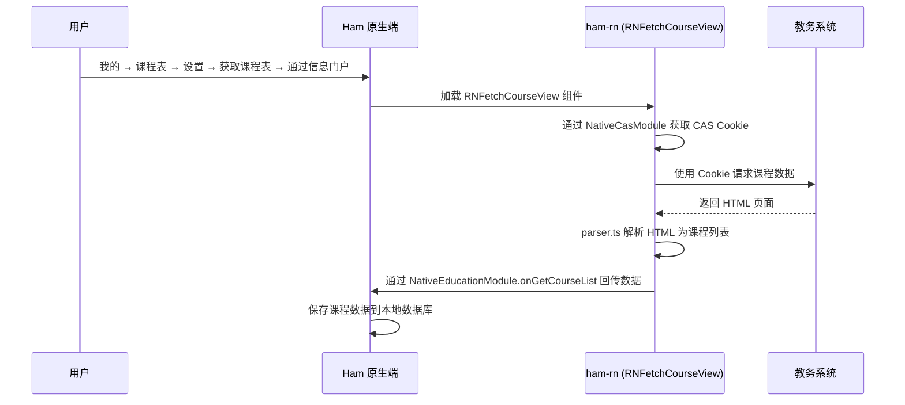
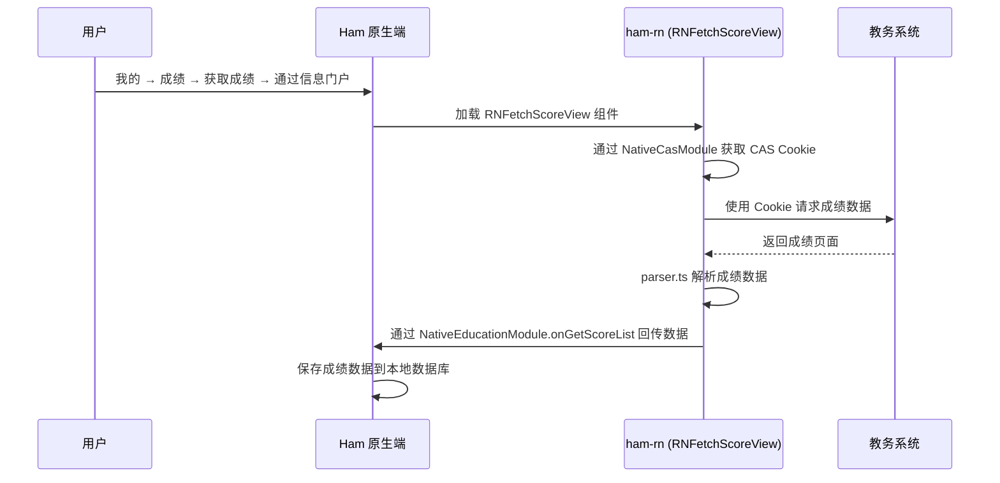

# 教务模块

教务模块是 ham-rn 的核心业务模块，负责从学校教务系统获取课程表和成绩数据。

## 课程查询

### 用户操作入口

**我的 → 课程表 → 设置 → 获取课程表 → 通过信息门户登录教务系统**

用户在「我的」页面进入课程表，点击设置，选择「获取课程表」，然后选择「通过信息门户登录教务系统」，通过 CAS 登录后自动获取课程表数据。

### 功能说明

课程查询模块从教务系统获取并解析课程表数据，将 HTML 页面转换为结构化的课程信息。

### 注册入口

| 注册名 | 类型 | 说明 |
| --- | --- | --- |
| `RNFetchCourseView` | 组件 | 课程查询视图 |

### 代码结构

**业务逻辑 (`business/education/course`)**

- `api.ts` — 课程数据请求接口，向教务系统发送 HTTP 请求
- `parser.ts` — HTML 响应解析器，将教务系统返回的页面解析为结构化数据
- `color.ts` — 课程颜色分配逻辑，为不同课程分配不同的显示颜色
- `type.ts` — 类型定义（`CourseEntity`、`CourseGridEntity`）

**UI 组件 (`components/education/course`)**

- `FetchCourseView.tsx` — 课程获取视图，展示获取进度和结果

### 工作流程

---

## 成绩查询

### 用户操作入口

**我的 → 成绩 → 获取成绩 → 通过信息门户**

用户在「我的」页面进入成绩，点击「获取成绩」，选择「通过信息门户」，通过 CAS 登录教务系统后自动获取成绩数据。

### 功能说明

成绩查询模块从教务系统获取学生的成绩数据，包括课程名称、学分、成绩、教师等信息。

### 注册入口

| 注册名 | 类型 | 说明 |
| --- | --- | --- |
| `RNFetchScoreView` | 组件 | 成绩查询视图 |

### 代码结构

**业务逻辑 (`business/education/score`)**

- `api.ts` — 成绩数据请求接口及用户信息获取
- `parser.ts` — 成绩数据解析器
- `type.ts` — 类型定义（`ScoreEntity`、`ScoreRequestUserInfo`）

**UI 组件 (`components/education/score`)**

- `FetchScoreView.tsx` — 成绩获取视图，展示获取进度和结果

### 工作流程

---

## 可调用模块

### 功能说明

`RNEducationCallable` 是一个通过 `BatchedBridge.registerCallableModule` 注册的可调用模块。与普通组件不同，原生端可以直接调用其方法而无需渲染 UI 组件。

### 注册入口

| 注册名 | 类型 | 说明 |
| --- | --- | --- |
| `RNEducationCallable` | 可调用模块 | 教务数据获取 |

### 提供的方法

- `updateCourseList(year, semester)` — 登录教务系统并获取指定学年学期的课程列表，通过 `NativeEducationModule.onGetCourseList` 回调结果
- `updateScoreList()` — 登录教务系统并获取成绩列表，通过 `NativeEducationModule.onGetScoreList` 回调结果

---

## 相关原生模块

| 模块 | 说明 |
| --- | --- |
| `NativeCasModule` | 请求已保存的 CAS Cookie，用于教务系统登录 |
| `NativeEducationModule` | 教务数据回调（课程列表、成绩列表、学期配置） |
