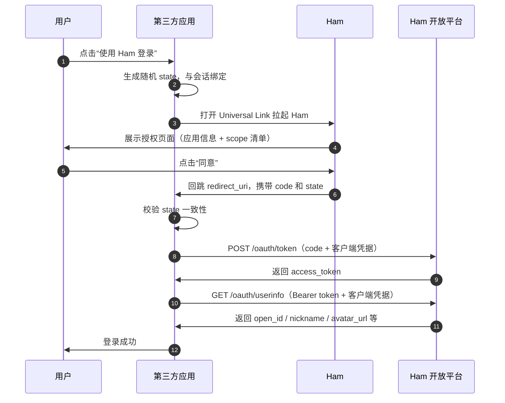

---
prev:
  text: '开发概述'
  link: '/development/'
next:
  text: '接入指南'
  link: '/development/open-platform/oauth2-guide'
---

# Ham互联

Ham互联是Ham开放平台提供的OAuth 2.0授权服务，允许第三方应用安全地获取Ham用户的授权信息。

## 概述

Ham互联基于标准的 **OAuth 2.0 Authorization Code Grant**（RFC 6749 §4.1）实现，第三方应用可以通过Ham互联实现"使用Ham登录"功能，在用户授权后获取其基本信息。

### 支持的权限范围（Scope）

| Scope | 描述 | 返回字段 |
|---|---|---|
| `profile` | 访问用户昵称和头像 | `nickname`、`avatar_url` |
| `is_student` | 访问用户是否为学生 | `is_student`（bool） |

> `open_id`（用户在当前应用下的唯一标识）始终返回，无需额外申请 scope。

## OAuth2 交互流程

### 流程说明

1. **发起授权**：第三方应用通过 Universal Link 拉起 Ham，携带 `client_id`、`scope`、`state`、`redirect_uri` 参数
2. **用户授权**：用户在 Ham 中查看授权信息并同意
3. **获取授权码**：Ham 回跳到第三方应用的 `redirect_uri`，URL 中携带一次性 `code`
4. **交换令牌**：第三方**服务端**使用 `code` + `client_id` + `client_secret` 向 Ham 开放平台换取 `access_token`
5. **获取用户信息**：第三方**服务端**使用 `access_token` + 客户端凭据请求用户信息

### 关键端点

| 端点 | 说明 |
|---|---|
| `https://ham.nowcent.cn/sso-authorize` | 授权发起入口（Universal Link），支持移动端、桌面端（如扫码）以及 Passkey 等多种授权方式 |
| `https://open-api.ham.nowcent.cn/oauth/token` | 令牌交换 |
| `https://open-api.ham.nowcent.cn/oauth/userinfo` | 获取用户信息 |

### 令牌有效期

| 令牌 | 有效期 | 说明 |
|---|---|---|
| Authorization Code | 5 分钟 | 一次性，使用后立即失效 |
| Access Token | 2 小时 | 过期后需引导用户重新授权 |
| Refresh Token | 不提供 | — |

## 获取 client_id 和 client_secret

`client_id` 和 `client_secret` 是第三方应用接入Ham互联的必要凭据：

- **client_id**：应用的公开标识，可在前端使用
- **client_secret**：应用的机密凭据，**仅限服务端使用**，严禁出现在前端代码、移动端包体或公开仓库中

::: warning 申请方式
目前 `client_id` 和 `client_secret` 需要联系开发者申请获取。

请通过 [GitHub Discussions](https://github.com/whu-ham/whu-ham.github.io/discussions) 联系我们，并提供以下信息：

1. 应用名称与简介
2. 回调地址（`redirect_uri`）白名单
3. 所需的权限范围（scope）
:::

## 安全须知

- 所有 API 调用必须使用 **HTTPS**
- `client_secret` 和 `access_token` **只在服务端存储和使用**
- 始终使用并校验 `state` 参数防御 CSRF 攻击
- 遵循**最小权限原则**，仅申请业务必需的 scope
- 使用 `open_id` 作为用户唯一标识，不要依赖 `nickname` 做唯一性判断

::: tip 完整文档
如需了解完整的接口规范、错误码、安全最佳实践等详细信息，请参阅 [接入指南](./oauth2-guide)。
:::
