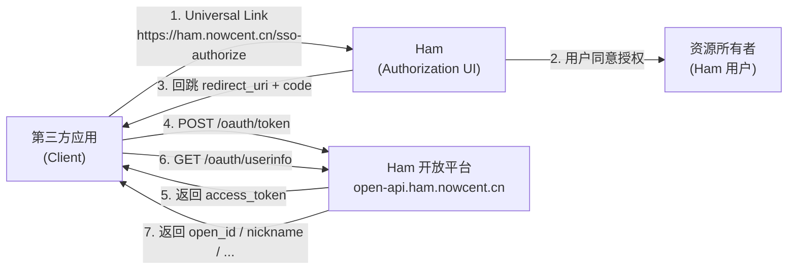
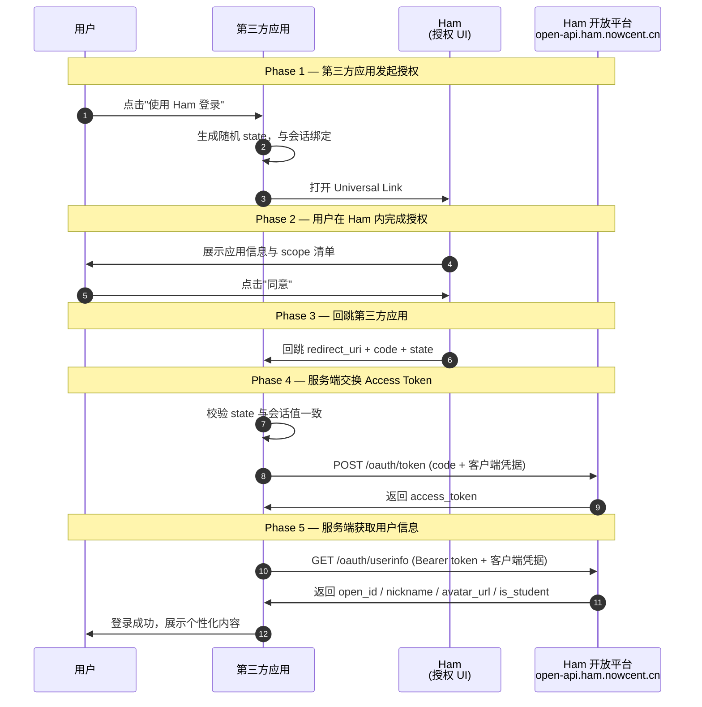

---
prev:
  text: 'Ham互联概述'
  link: '/development/open-platform/'
next:
  text: 'Ham Web 概述'
  link: '/development/ham-web/'
---

# 接入指南

> 本文档面向希望接入 **Ham 开放平台** 的第三方应用开发者，系统介绍 Ham 基于 OAuth 2.0 Authorization Code Grant（RFC 6749 §4.1）实现的 SSO 授权流程、接口规范、接入细节以及安全最佳实践。
>
> - **开放平台 API 域名**：`https://open-api.ham.nowcent.cn`（所有服务端到服务端的 HTTP 调用均走此域名，强制 HTTPS）
> - **授权发起入口（Universal Link）**：`https://ham.nowcent.cn/sso-authorize?client_id=xxx&scope=profile,is_student&state=yyy&redirect_uri={redirect_uri}`

## 1. 基本概念与角色定义

Ham 开放平台实现的是标准的 **OAuth 2.0 Authorization Code Grant**（RFC 6749 §4.1）。Ham 的授权确认界面支持多种方式，包括移动端原生授权、桌面端扫码授权以及 Passkey 认证等，因此整个流程中存在四个角色。

### 1.1 四个角色

| 角色 | 英文名 | 承载方 | 职责 |
|---|---|---|---|
| **资源所有者** | Resource Owner | Ham 登录用户 | 拥有受保护资源（个人信息、学生身份等）。决定是否授权第三方应用访问 |
| **客户端** | Client | 第三方应用（Web / App / 服务端） | **本文档面向对象**。发起授权请求、接收 `code`、在服务端换取 `access_token`、调用 UserInfo 接口 |
| **授权 UI** | Authorization UI | Ham | 接收来自第三方的 Deep Link，展示授权同意页，由用户做出授权决定。支持移动端原生授权、桌面端扫码授权及 Passkey 认证 |
| **授权/资源服务器** | Authorization / Resource Server | Ham 后端（`open-api.ham.nowcent.cn`） | 签发授权码、Access Token，校验第三方凭据，按 scope 过滤并返回用户资源 |

**角色交互关系（第三方视角）：**



### 1.2 关键术语

| 术语 | 说明 |
|---|---|
| **Client ID**（`client_id`） | 第三方应用在 Ham 开放平台注册后获得的**公开标识** |
| **Client Secret**（`client_secret`） | 第三方应用在 Ham 开放平台注册后获得的**机密凭据**。**仅服务端持有**，严禁出现在前端代码、移动端包体、公开仓库 |
| **Redirect URI** | 授权完成后 Ham 回跳到的第三方应用地址。必须事先在 Ham 开放平台控制台**白名单登记**，服务端以**精确字符串匹配**校验 |
| **Authorization Code**（`code`） | 一次性、短期有效的中间凭证，用于换取 Access Token。有效期 **5 分钟** |
| **Access Token** | 访问用户信息的 Bearer 令牌。有效期 **2 小时**。无 Refresh Token（过期后需引导用户重新授权） |
| **Scope** | 授权范围，详见 [1.3](#_1-3-scope-权限范围) |
| **State** | 由客户端生成的不可预测随机字符串，用于防止 CSRF 攻击，Ham 会在回跳 URL 中原样返回 |
| **open_id** | 用户在当前第三方应用下的稳定唯一标识。**确定性**（同一用户 + 同一应用永远相同）、**不可逆**、**跨应用不同** |

### 1.3 Scope 权限范围

当前 Ham 开放平台支持以下 scope，遵循**最小权限原则**，仅申请业务必需的权限：

| Scope | 描述 | UserInfo 返回字段 |
|---|---|---|
| `profile` | 访问你的昵称和头像 | `nickname`、`avatar_url` |
| `is_student` | 访问你是否为学生 | `is_student`（bool） |

> **说明**：未列出的 scope 会被服务端静默过滤。`open_id` 始终返回，无需额外 scope。

## 2. 标准授权码流程详解

### 2.1 流程时序图



### 2.2 分步说明

**Phase 1 — 第三方应用发起授权**

1. 用户在第三方应用中点击"使用 Ham 登录"等入口。
2. 第三方应用**在自身服务端**生成：
   - `state`：不可预测随机字符串（建议 ≥ 32 字节熵），与当前用户会话绑定保存（Session / Redis）。
   - 选定本次要使用的 `redirect_uri`：必须是在 Ham 开放平台控制台已登记的白名单地址之一，唯一支持 HTTPS。
3. 第三方应用通过 Universal Link 方式拉起 Ham：

   ```
   https://ham.nowcent.cn/sso-authorize?client_id=xxx&scope=profile,is_student&state=yyy&redirect_uri={redirect_uri}
   ```

**Phase 2 — 用户在 Ham 内完成授权**

4. Ham 要求用户已登录 Ham 账号，展示第三方应用名称、图标及请求的 scope 清单。
5. 用户在 Ham 内点击"同意"完成授权。若用户此前已对同一应用授权过相同的 scope，Ham 可跳过同意页，实现无感授权。

**Phase 3 — 回跳第三方应用**

6. Ham 后端校验 `redirect_uri` 是否在该应用的**白名单**内；校验通过后，Ham 打开该地址，URL 查询参数中携带 `code` 与原样的 `state`：

   ```
   {传入的 redirect_uri}?code={code}&state={state}
   ```

**Phase 4 — 第三方服务端交换 Access Token**

7. 第三方应用在 `redirect_uri` 上接收到 `code` 和 `state`：
   - **必须**先校验 `state` 与会话值严格相等；
   - 将 `code` 立即传回自身服务端。
8. 第三方**服务端**向 `https://open-api.ham.nowcent.cn/oauth/token` 发起 POST 请求，携带客户端凭据交换 Access Token。

**Phase 5 — 服务端获取用户信息**

9. 第三方**服务端**带着 `Bearer {access_token}` + 客户端凭据，请求 `https://open-api.ham.nowcent.cn/oauth/userinfo`。
10. 第三方以 `open_id` 作为用户唯一标识，完成登录/绑定等业务逻辑。

## 3. 核心操作环节说明

### 3.1 构建授权请求（拉起 Ham）

**Universal Link 格式：**

```
https://ham.nowcent.cn/sso-authorize?client_id={client_id}&scope={scopes}&state={state}&redirect_uri={redirect_uri}
```

**参数说明：**

| 参数 | 必填 | 说明 |
|---|---|---|
| `client_id` | 必填 | 注册时获得的 Client ID |
| `scope` | 必填 | 英文逗号分隔，例如 `profile,is_student` |
| `state` | **强烈建议必填** | CSRF 防御用随机串，需与当前用户会话绑定 |
| `redirect_uri` | **必填** | 授权成功后 Ham 回跳的目标地址。必须已在控制台**白名单登记**，拼入查询串时需做 **percent-encoding** |

**Web 示例：**

```html
<a href="https://ham.nowcent.cn/sso-authorize?client_id=abc123&scope=profile,is_student&state=xY7Kq9fZ2pLmN8vB&redirect_uri=https%3A%2F%2Fyour-app.example.com%2Fcallback">
  使用 Ham 登录
</a>
```

**JS 示例：**

```js
const state = crypto.randomUUID();
sessionStorage.setItem('ham_oauth_state', state);
const redirectUri = 'https://your-app.example.com/callback';
const params = new URLSearchParams({
  client_id: 'abc123',
  scope: 'profile,is_student',
  state,
  redirect_uri: redirectUri,
});
location.href = `https://ham.nowcent.cn/sso-authorize?${params.toString()}`;
```

### 3.2 处理授权回调

**成功回跳：**

```
https://your-app.example.com/callback?code=SplxlOBeZQQYbYS6WxSbIA&state=xY7Kq9fZ2pLmN8vB
```

**用户取消/授权失败**：Ham 不会进行回跳，第三方应保留"再次尝试登录"入口。

**客户端处理要点：**

1. 先校验 `state` 与会话中的值**严格相等**，不等直接终止并向用户报错；
2. 仅在校验通过后，立即将 `code` 发回自身服务端进行令牌交换；
3. **不要**把 `code` 落在前端日志、URL 书签、Referrer 或前端持久化存储中。

### 3.3 令牌交换（Code → Access Token）

**端点**：

```
POST https://open-api.ham.nowcent.cn/oauth/token
```

**请求头：**

```
Content-Type: application/x-www-form-urlencoded
Authorization: Basic {BASE64(client_id:client_secret)}
```

**请求体：**

| 参数 | 必填 | 说明 |
|---|---|---|
| `grant_type` | 是 | 固定为 `authorization_code` |
| `code` | 是 | Phase 3 获得的授权码 |
| `client_id` | 条件 | 未使用 Basic Auth 时必填 |
| `client_secret` | 条件 | 未使用 Basic Auth 时必填 |

**成功响应（200 OK）：**

```json
{
  "access_token": "a1b2c3d4e5f6...",
  "token_type": "Bearer",
  "expires_in": 7200,
  "scope": "profile is_student"
}
```

**失败响应：**

```json
{
  "error": "invalid_grant",
  "error_description": "The authorization code is invalid or expired"
}
```

**cURL 示例：**

```bash
curl -X POST https://open-api.ham.nowcent.cn/oauth/token \
  -u "abc123:your_client_secret" \
  -H "Content-Type: application/x-www-form-urlencoded" \
  -d "grant_type=authorization_code&code=SplxlOBeZQQYbYS6WxSbIA"
```

### 3.4 访问用户信息（UserInfo）

**端点**：

```
GET https://open-api.ham.nowcent.cn/oauth/userinfo
```

**请求头：**

```
Authorization: Bearer {access_token}
```

> **注意**：UserInfo 接口要求**同时**传递 Access Token 与客户端凭据（双因子校验）。

**成功响应（200 OK）：**

```json
{
  "open_id": "3f7a9c2b...e8",
  "nickname": "张三",
  "avatar_url": "https://cdn.ham.nowcent.cn/avatar/xxx.jpg",
  "is_student": true,
  "scope": "profile is_student"
}
```

**字段说明：**

| 字段 | 说明 | 返回条件 |
|---|---|---|
| `open_id` | 用户在当前应用下的稳定唯一标识 | 始终返回 |
| `nickname` | 用户昵称 | 授予 `profile` 时返回 |
| `avatar_url` | 用户头像 URL | 授予 `profile` 时返回 |
| `is_student` | 是否为学生 | 授予 `is_student` 时返回 |
| `scope` | 实际授予的 scope（空格分隔） | 始终返回 |

**cURL 示例：**

```bash
curl https://open-api.ham.nowcent.cn/oauth/userinfo \
  -u "abc123:your_client_secret" \
  -H "Authorization: Bearer a1b2c3d4e5f6..."
```

### 3.5 令牌类型与有效期

| 令牌 | 生命周期 | 说明 |
|---|---|---|
| `authorization_code` | 5 分钟 | 一次性凭证，换取 Access Token 后立即失效 |
| `access_token` | 2 小时（`expires_in = 7200`） | Opaque Token，**禁止**在客户端尝试解析其内容 |
| **Refresh Token** | 不提供 | Access Token 过期后需引导用户**重新授权** |

## 4. 安全实践与注意事项

### 4.1 安全最佳实践清单

- 所有 HTTP 调用**必须**走 HTTPS，TLS 1.2+
- `client_secret`、`access_token` **只在服务端存储**，严禁出现在前端代码、移动端包体、公开仓库
- `access_token` 若需下发到浏览器，应放入 **HttpOnly + Secure + SameSite=Lax/Strict** 的 Cookie
- **始终**使用并校验 `state` 参数，防御 CSRF
- 严格遵守"前端拉起 Deep Link → 服务端换 Token → 服务端调 UserInfo"的分工
- 申请 scope 遵循**最小权限原则**
- 使用 `open_id` 作为用户稳定标识

### 4.2 常见安全风险与防范

| 风险 | 攻击方式 | 防范措施 |
|---|---|---|
| **CSRF** | 攻击者构造授权链接诱导受害者点击 | 强制生成随机 `state` 并在回调严格校验 |
| **授权码拦截** | 恶意 App 抢注 URL Scheme 劫持回调 | 使用预注册的 HTTPS `redirect_uri` |
| **`client_secret` 泄漏** | secret 被嵌入前端包体、公开仓库 | secret 只在服务端；使用秘钥管理；定期轮换 |
| **令牌泄漏** | 通过 URL、Referrer、日志泄漏 | Token 只走请求头；日志脱敏 |
| **XSS 窃取令牌** | 前端脚本读取 `localStorage` 中的 token | 使用 HttpOnly Cookie；严格 CSP |

### 4.3 错误处理与异常应对

| HTTP 状态 | error | 触发场景 | 客户端处理 |
|---|---|---|---|
| 400 | `unsupported_grant_type` | `grant_type` 不是 `authorization_code` | 检查请求参数 |
| 400 | `invalid_request` | 缺少必填参数 | 修复参数后重试 |
| 400 | `invalid_grant` | `code` 无效/过期/已使用 | 引导用户重新授权 |
| 401 | `invalid_client` | 客户端凭据错误 | 检查客户端凭据 |
| 401 | `invalid_token` | `access_token` 无效/过期 | 引导用户重新授权 |
| 403 | `insufficient_scope` | token 未授予此 `client_id` | 使用正确的凭据或重新授权 |
| 5xx | `server_error` | 服务端异常 | 指数退避重试 |

---

**参考规范**

- RFC 6749 — The OAuth 2.0 Authorization Framework
- RFC 6750 — The OAuth 2.0 Authorization Framework: Bearer Token Usage
- RFC 9700 — Best Current Practice for OAuth 2.0 Security

**开源**

Ham 的 Web 端源码已在 GitHub 开源：[whu-ham/ham-web](https://github.com/whu-ham/ham-web)，你可以参考其中的 OAuth 2.0 授权实现。
