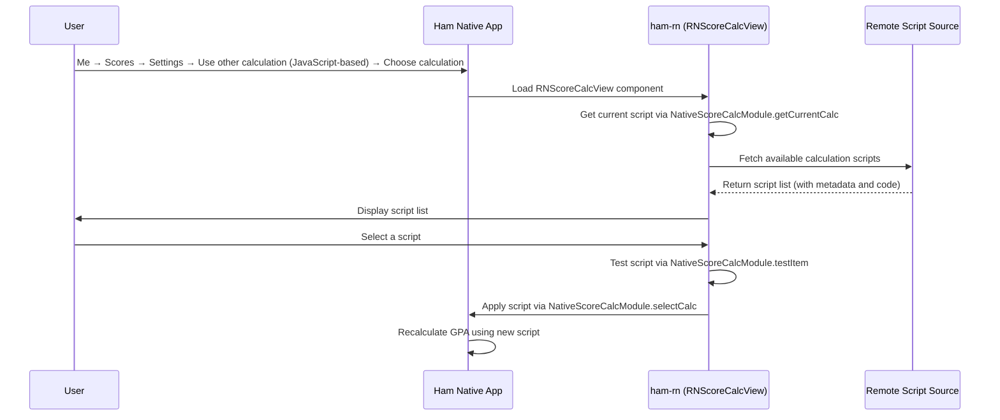

# Score Calculator Module

## User Entry Point

**Me → Scores → Settings → F2 Calculation Method → Use other calculation (JavaScript-based) → Choose calculation**

Users go to the "Me" page, enter Scores, tap Settings, under "F2 calculation method" select "Use other calculation (JavaScript-based)", then tap "Choose calculation" to enter the score calculation script selection page, which is rendered by Ham React Native Components.

## Features

The score calculator module provides custom GPA / weighted score calculation based on JavaScript. Users can:

1. Browse available calculation scripts (from GitHub and other sources)
2. Select and apply a calculation script
3. View script details (author, version, update notes, etc.)
4. Test whether a script runs correctly

## Registered Entry

| Registration Name | Type | Description |
| --- | --- | --- |
| `RNScoreCalcView` | Component | Score calculation script selection view |

## Code Structure

### Business Logic (`business/education/scorecalc`)

- `fetch.ts` — Fetches available calculation scripts from remote sources
- `type.ts` — Type definitions (calculation script metadata structure)

### UI Components (`components/scorecalc`)

- `ScoreCalcView.tsx` — Score calculator main view, containing sub-components:
  - Current score card — Displays the currently selected calculation method
  - Description cell — Shows script description and update notes
  - Developer card — Displays script author information
  - GitHub link card — Links to the script's GitHub repository

## Workflow



## Calculation Script Format

A calculation script is a JavaScript function that receives a score list JSON string and user info JSON string, returning an array:

```javascript
/**
 * @param {string} scoreListJson - Score list JSON string
 * @param {string} userInfoJson - User info JSON string
 * @returns {[number, string[]]} - [calculation result, selected course ID list]
 */
function calc(scoreListJson, userInfoJson) {
    const scoreList = JSON.parse(scoreListJson);
    const userInfo = JSON.parse(userInfoJson);
    // Custom calculation logic
    return [score, selectedCourseIds];
}
```

## How to Add a New Calculation Method

### Step 1: Create a Calculation Script

Create a new `.ts` file under `src/business/education/scorecalc/embed/` and use the `defineEmbed` function to define your calculation logic:

```typescript
import {defineEmbed} from '@/business/education/scorecalc/defineEmbed';

defineEmbed((scoreList, userInfo) => {
  // scoreList: ScoreJsItem[] — list of course scores
  // userInfo: UserInfo — user information

  // Write your calculation logic here
  let totalWeighted = 0;
  let totalCredit = 0;
  const selectedIds: string[] = [];

  for (const item of scoreList) {
    totalWeighted += item.credit * item.score;
    totalCredit += item.credit;
    selectedIds.push(item.courseId);
  }

  const result = totalCredit > 0 ? totalWeighted / totalCredit : 0;

  // Return [calculated score, list of course IDs used in calculation]
  return [result, selectedIds];
});
```

### Step 2: Available Fields

Each element (`ScoreJsItem`) in `scoreList` contains the following fields:

| Field | Type | Description |
| --- | --- | --- |
| `courseType` | `string` | Course category (e.g. "公共基础必修") |
| `name` | `string` | Course name (e.g. "高等数学") |
| `credit` | `number` | Credit hours |
| `courseCollege` | `string` | College offering the course |
| `instructor` | `string` | Instructor name |
| `score` | `number` | Numeric score |
| `courseId` | `string` | Unique course identifier |

`userInfo` (`UserInfo`) contains the following fields:

| Field | Type | Description |
| --- | --- | --- |
| `userCollege` | `string` | User's college (e.g. "计算机学院") |

### Step 3: Register the Script

Add a new entry in the `fetchScoreCalcFromLocal` function in `src/business/education/scorecalc/fetch.ts`:

```typescript
import newScript from './embed/generated/your-script.generated';

const fetchScoreCalcFromLocal = (): Array<ScoreCalcItem> => {
  return [
    // ... existing entries
    {
      title: 'Your Calculation Method Name',
      date: '2026-01-01',
      author: 'Author Name',
      version: 1,
      brief: 'Short description',
      updateBrief: 'Update notes',
      desc: 'Detailed description',
      type: 'APP',
      url: 'https://raw.githubusercontent.com/whu-ham/ham-rn/main/src/business/education/scorecalc/embed/your-script.ts',
      script: newScript,
    },
  ];
};
```

### Notes

- `defineEmbed` registers your calculation function on `globalThis.calc`, making it callable from the native JSContext (e.g. iOS JavaScriptCore).
- The return value must be in `[number, string[]]` format — the first element is the calculated score, the second is the list of course IDs that contributed to the calculation.
- `.ts` files in the `embed/` directory are compiled into corresponding `.generated` files at build time, which are then imported by `fetch.ts`.
- You can filter courses by `courseType` (e.g. required vs. elective), or implement college-specific logic using `userCollege`.

## Related Native Modules

| Module | Description |
| --- | --- |
| `NativeScoreCalcModule` | Score calculation script management (get current / select / view details / test scripts) |
