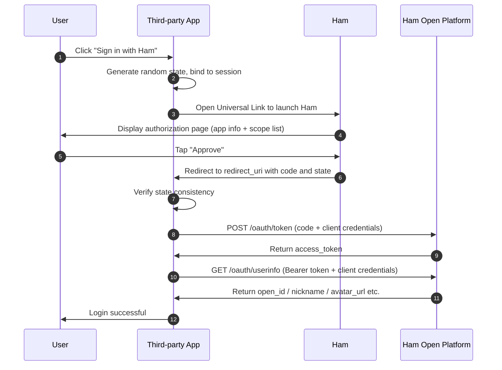

# Ham Connect

Ham Connect is the OAuth 2.0 authorization service provided by the Ham Open Platform, allowing third-party applications to securely obtain authorized Ham user information.

## Overview

Ham Connect is built on the standard **OAuth 2.0 Authorization Code Grant** (RFC 6749 §4.1). Third-party applications can implement "Sign in with Ham" functionality through Ham Connect to obtain basic user information after authorization.

### Supported Scopes

| Scope | Description | Returned Fields |
|---|---|---|
| `profile` | Access user nickname and avatar | `nickname`, `avatar_url` |
| `is_student` | Access whether the user is a student | `is_student` (bool) |

> `open_id` (the user's unique identifier within the current application) is always returned and does not require an additional scope.

## OAuth2 Interaction Flow

### Flow Description

1. **Initiate Authorization**: The third-party app launches Ham via Universal Link with `client_id`, `scope`, `state`, and `redirect_uri` parameters
2. **User Authorization**: The user reviews the authorization details in Ham and approves
3. **Receive Authorization Code**: Ham redirects to the third-party app's `redirect_uri` with a one-time `code`
4. **Exchange Token**: The third-party **server** exchanges the `code` + `client_id` + `client_secret` for an `access_token`
5. **Fetch User Info**: The third-party **server** uses the `access_token` + client credentials to request user information

### Key Endpoints

| Endpoint | Description |
|---|---|
| `https://ham.nowcent.cn/sso-authorize` | Authorization entry (Universal Link), supports mobile, desktop (e.g. QR code scanning), and Passkey authentication |
| `https://open-api.ham.nowcent.cn/oauth/token` | Token exchange |
| `https://open-api.ham.nowcent.cn/oauth/userinfo` | Fetch user info |

### Token Lifetime

| Token | Lifetime | Notes |
|---|---|---|
| Authorization Code | 5 minutes | One-time use, invalidated after exchange |
| Access Token | 2 hours | Re-authorization required after expiry |
| Refresh Token | Not provided | — |

## Obtaining client_id and client_secret

`client_id` and `client_secret` are the required credentials for integrating with Ham Connect:

- **client_id**: The public identifier of the application, safe to use on the frontend
- **client_secret**: The confidential credential of the application, **must only be used on the server side** — never expose it in frontend code, mobile app bundles, or public repositories

::: warning How to Apply
Currently, `client_id` and `client_secret` must be obtained by contacting the developers.

Please reach out via [GitHub Discussions](https://github.com/whu-ham/whu-ham.github.io/discussions) and provide the following information:

1. Application name and description
2. Callback URL (`redirect_uri`) whitelist
3. Required scopes
:::

## Security Notes

- All API calls must use **HTTPS**
- `client_secret` and `access_token` must **only be stored and used on the server side**
- Always use and verify the `state` parameter to prevent CSRF attacks
- Follow the **principle of least privilege** — only request the scopes your business needs
- Use `open_id` as the unique user identifier; do not rely on `nickname` for uniqueness

::: tip Full Documentation
For complete API specifications, error codes, and security best practices, please refer to the [Integration Guide](./oauth2-guide).
:::
