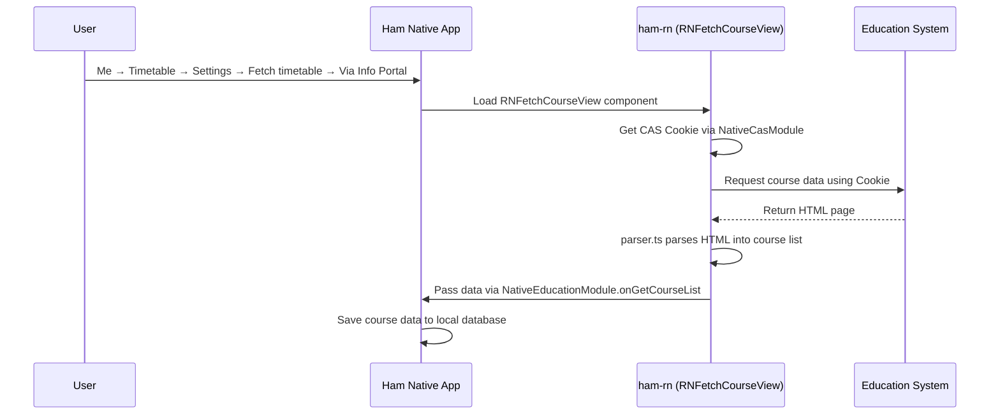
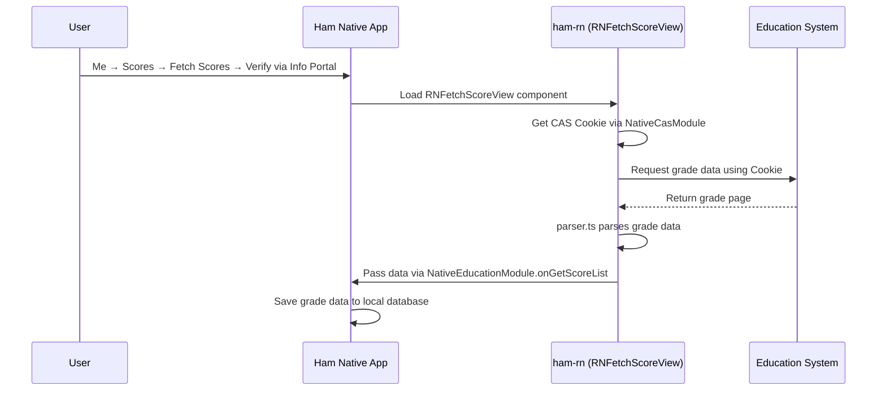

# Education Module

The education module is the core business module of ham-rn, responsible for fetching course schedules and grade data from the university's education system.

## Course Query

### User Entry Point

**Me → Timetable → Settings → Fetch timetable → Via Info Portal**

Users go to the "Me" page, enter the timetable, tap settings, select "Fetch timetable", then choose "Via Info Portal" to log in to the education system via CAS and automatically retrieve course schedule data.

### Features

The course query module fetches and parses course schedule data from the education system, converting HTML pages into structured course information.

### Registered Entry

| Registration Name | Type | Description |
| --- | --- | --- |
| `RNFetchCourseView` | Component | Course schedule query view |

### Code Structure

**Business Logic (`business/education/course`)**

- `api.ts` — Course data request API, sends HTTP requests to the education system
- `parser.ts` — HTML response parser, converts education system pages into structured data
- `color.ts` — Course color assignment logic, assigns different display colors to courses
- `type.ts` — Type definitions (`CourseEntity`, `CourseGridEntity`)

**UI Components (`components/education/course`)**

- `FetchCourseView.tsx` — Course fetch view, displays progress and results

### Workflow

---

## Grade Query

### User Entry Point

**Me → Scores → Fetch Scores → Verify via Info Portal**

Users go to the "Me" page, enter Scores, tap "Fetch Scores", then choose "Verify via Info Portal" to log in to the education system via CAS and automatically retrieve grades.

### Features

The grade query module fetches student grade data from the education system, including course name, credits, score, instructor, and more.

### Registered Entry

| Registration Name | Type | Description |
| --- | --- | --- |
| `RNFetchScoreView` | Component | Grade query view |

### Code Structure

**Business Logic (`business/education/score`)**

- `api.ts` — Grade data request API and user info retrieval
- `parser.ts` — Grade data parser
- `type.ts` — Type definitions (`ScoreEntity`, `ScoreRequestUserInfo`)

**UI Components (`components/education/score`)**

- `FetchScoreView.tsx` — Grade fetch view, displays progress and results

### Workflow

---

## Callable Module

### Features

`RNEducationCallable` is a callable module registered via `BatchedBridge.registerCallableModule`. Unlike regular components, the native side can invoke its methods directly without rendering a UI component.

### Registered Entry

| Registration Name | Type | Description |
| --- | --- | --- |
| `RNEducationCallable` | Callable Module | Education data fetching |

### Methods

- `updateCourseList(year, semester)` — Logs into the education system and fetches the course list for the specified year/semester, returning results via `NativeEducationModule.onGetCourseList` callback
- `updateScoreList()` — Logs into the education system and fetches the grade list, returning results via `NativeEducationModule.onGetScoreList` callback

---

## Related Native Modules

| Module | Description |
| --- | --- |
| `NativeCasModule` | Request saved CAS Cookie for education system login |
| `NativeEducationModule` | Education data callbacks (course list, grade list, semester config) |
