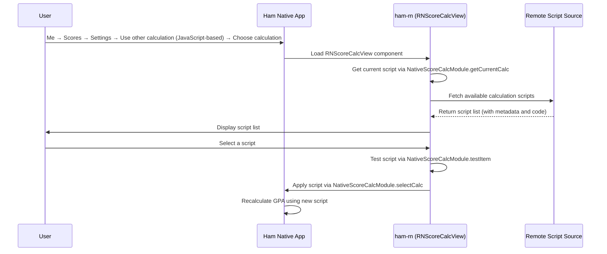

# Score Calculator Module

## User Entry Point

**Me → Scores → Settings → F2 Calculation Method → Use other calculation (JavaScript-based) → Choose calculation**

Users go to the "Me" page, enter Scores, tap Settings, under "F2 calculation method" select "Use other calculation (JavaScript-based)", then tap "Choose calculation" to enter the score calculation script selection page, which is rendered by ham-rn.

## Features

The score calculator module provides custom GPA / weighted score calculation based on JavaScript. Users can:

1. Browse available calculation scripts (from GitHub and other sources)
2. Select and apply a calculation script
3. View script details (author, version, update notes, etc.)
4. Test whether a script runs correctly

## Registered Entry

| Registration Name | Type | Description |
| --- | --- | --- |
| `RNScoreCalcView` | Component | Score calculation script selection view |

## Code Structure

### Business Logic (`business/education/scorecalc`)

- `fetch.ts` — Fetches available calculation scripts from remote sources
- `type.ts` — Type definitions (calculation script metadata structure)

### UI Components (`components/scorecalc`)

- `ScoreCalcView.tsx` — Score calculator main view, containing sub-components:
  - Current score card — Displays the currently selected calculation method
  - Description cell — Shows script description and update notes
  - Developer card — Displays script author information
  - GitHub link card — Links to the script's GitHub repository

## Workflow



## Calculation Script Format

A calculation script is a JavaScript function that receives a score list JSON string and user info JSON string, returning an array:

```javascript
/**
 * @param {string} scoreListJson - Score list JSON string
 * @param {string} userInfoJson - User info JSON string
 * @returns {[number, string[]]} - [calculation result, selected course ID list]
 */
function calc(scoreListJson, userInfoJson) {
    const scoreList = JSON.parse(scoreListJson);
    const userInfo = JSON.parse(userInfoJson);
    // Custom calculation logic
    return [score, selectedCourseIds];
}
```

## Related Native Modules

| Module | Description |
| --- | --- |
| `NativeScoreCalcModule` | Score calculation script management (get current / select / view details / test scripts) |
