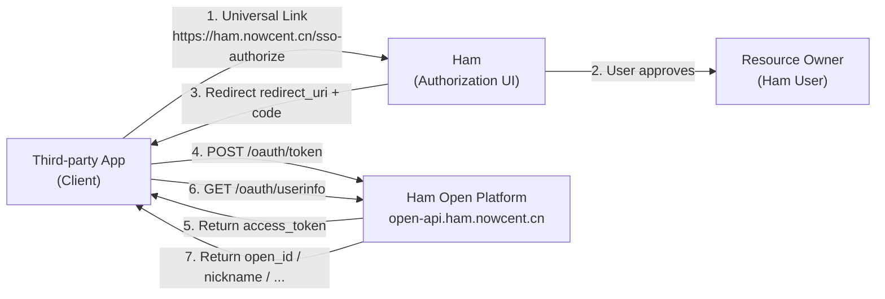
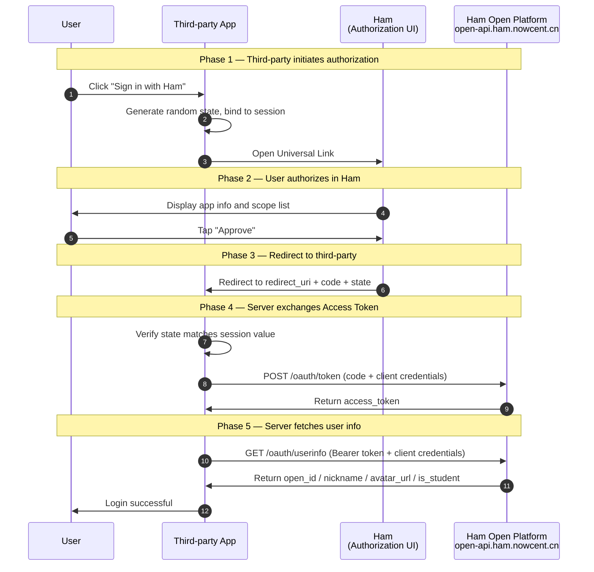

# OAuth 2.0 Full Integration Guide

> This document is intended for third-party application developers who wish to integrate with the **Ham Open Platform**. It provides a comprehensive introduction to the SSO authorization flow, API specifications, integration details, and security best practices based on OAuth 2.0 Authorization Code Grant (RFC 6749 §4.1).
>
> - **Open Platform API Domain**: `https://open-api.ham.nowcent.cn` (all server-to-server HTTP calls use this domain, HTTPS enforced)
> - **Authorization Entry (Universal Link)**: `https://ham.nowcent.cn/sso-authorize?client_id=xxx&scope=profile,is_student&state=yyy&redirect_uri={redirect_uri}`

## 1. Basic Concepts and Role Definitions

The Ham Open Platform implements the standard **OAuth 2.0 Authorization Code Grant** (RFC 6749 §4.1). Ham's authorization confirmation UI supports multiple methods including mobile native authorization, desktop QR code scanning, and Passkey authentication, resulting in four roles in the flow.

### 1.1 Four Roles

| Role | Hosted By | Responsibility |
|---|---|---|
| **Resource Owner** | Ham logged-in user | Owns protected resources (personal info, student identity, etc.). Decides whether to authorize third-party access |
| **Client** | Third-party application (Web / App / Server) | **Target audience of this document**. Initiates authorization requests, receives `code`, exchanges for `access_token` on server side, calls UserInfo API |
| **Authorization UI** | Ham | Receives Deep Link from third-party, displays authorization consent page. Supports mobile native authorization, desktop QR code scanning, and Passkey authentication |
| **Authorization / Resource Server** | Ham Backend (`open-api.ham.nowcent.cn`) | Issues authorization codes, Access Tokens, validates third-party credentials, filters and returns user resources by scope |

**Role Interaction (Third-party Perspective):**



### 1.2 Key Terminology

| Term | Description |
|---|---|
| **Client ID** (`client_id`) | The **public identifier** obtained after registering on the Ham Open Platform |
| **Client Secret** (`client_secret`) | The **confidential credential** obtained after registration. **Server-side only** — never expose in frontend code, mobile bundles, or public repositories |
| **Redirect URI** | The address Ham redirects to after authorization. Must be **whitelisted** in the Ham Open Platform console; validated by **exact string matching** |
| **Authorization Code** (`code`) | A one-time, short-lived intermediate credential for exchanging Access Token. Valid for **5 minutes** |
| **Access Token** | Bearer token for accessing user information. Valid for **2 hours**. No Refresh Token (re-authorization required after expiry) |
| **Scope** | Authorization scope, see [1.3](#_1-3-scope-permissions) |
| **State** | An unpredictable random string generated by the client to prevent CSRF attacks; returned as-is in the redirect URL |
| **open_id** | A stable unique identifier for the user within the current third-party app. **Deterministic** (same user + same app = always the same), **irreversible**, **different across apps** |

### 1.3 Scope Permissions

The Ham Open Platform currently supports the following scopes. Follow the **principle of least privilege** and only request what your business needs:

| Scope | Description | UserInfo Returned Fields |
|---|---|---|
| `profile` | Access nickname and avatar | `nickname`, `avatar_url` |
| `is_student` | Access student status | `is_student` (bool) |

> **Note**: Unlisted scopes are silently filtered by the server. `open_id` is always returned without requiring an additional scope.

## 2. Authorization Code Flow in Detail

### 2.1 Sequence Diagram



### 2.2 Step-by-Step Description

**Phase 1 — Third-party Initiates Authorization**

1. User clicks "Sign in with Ham" in the third-party app.
2. The third-party app **on its server** generates:
   - `state`: An unpredictable random string (recommended ≥ 32 bytes of entropy), bound to the current user session (Session / Redis).
   - Selected `redirect_uri`: Must be one of the whitelisted addresses registered in the Ham Open Platform console, HTTPS only.
3. The third-party app launches Ham via Universal Link:

   ```
   https://ham.nowcent.cn/sso-authorize?client_id=xxx&scope=profile,is_student&state=yyy&redirect_uri={redirect_uri}
   ```

**Phase 2 — User Authorizes in Ham**

4. Ham requires the user to be logged in, displays the third-party app name, icon, and requested scope list.
5. User taps "Approve" in Ham. If the user has previously authorized the same scopes for the same app, Ham may skip the consent page for a seamless experience.

**Phase 3 — Redirect to Third-party**

6. Ham backend validates that the `redirect_uri` is in the app's **whitelist**; upon success, Ham opens the address with `code` and the original `state` in query parameters:

   ```
   {redirect_uri}?code={code}&state={state}
   ```

**Phase 4 — Server Exchanges Access Token**

7. The third-party app receives `code` and `state` at the `redirect_uri`:
   - **Must** first verify `state` strictly equals the session value;
   - Immediately send `code` to its own server.
8. The third-party **server** sends a POST request to `https://open-api.ham.nowcent.cn/oauth/token` with client credentials to exchange for an Access Token.

**Phase 5 — Server Fetches User Info**

9. The third-party **server** uses `Bearer {access_token}` + client credentials to request `https://open-api.ham.nowcent.cn/oauth/userinfo`.
10. The third-party uses `open_id` as the unique user identifier to complete login/binding logic.

## 3. Core Operations

### 3.1 Building the Authorization Request (Launching Ham)

**Universal Link Format:**

```
https://ham.nowcent.cn/sso-authorize?client_id={client_id}&scope={scopes}&state={state}&redirect_uri={redirect_uri}
```

**Parameters:**

| Parameter | Required | Description |
|---|---|---|
| `client_id` | Required | Client ID obtained during registration |
| `scope` | Required | Comma-separated, e.g. `profile,is_student` |
| `state` | **Strongly recommended** | Random string for CSRF defense, bound to user session |
| `redirect_uri` | **Required** | Target redirect address after authorization. Must be **whitelisted** in the console; must be **percent-encoded** when included in the query string |

**Web Example:**

```html
<a href="https://ham.nowcent.cn/sso-authorize?client_id=abc123&scope=profile,is_student&state=xY7Kq9fZ2pLmN8vB&redirect_uri=https%3A%2F%2Fyour-app.example.com%2Fcallback">
  Sign in with Ham
</a>
```

**JS Example:**

```js
const state = crypto.randomUUID();
sessionStorage.setItem('ham_oauth_state', state);
const redirectUri = 'https://your-app.example.com/callback';
const params = new URLSearchParams({
  client_id: 'abc123',
  scope: 'profile,is_student',
  state,
  redirect_uri: redirectUri,
});
location.href = `https://ham.nowcent.cn/sso-authorize?${params.toString()}`;
```

### 3.2 Handling the Authorization Callback

**Successful Redirect:**

```
https://your-app.example.com/callback?code=SplxlOBeZQQYbYS6WxSbIA&state=xY7Kq9fZ2pLmN8vB
```

**User Cancels / Authorization Fails**: Ham will not redirect; the third-party should keep a "Try again" login entry.

**Client Handling Points:**

1. First verify `state` **strictly equals** the session value; terminate and show error if not;
2. Only after verification, immediately send `code` to your server for token exchange;
3. **Do not** persist `code` in frontend logs, URL bookmarks, Referrer, or frontend storage.

### 3.3 Token Exchange (Code → Access Token)

**Endpoint:**

```
POST https://open-api.ham.nowcent.cn/oauth/token
```

**Request Headers:**

```
Content-Type: application/x-www-form-urlencoded
Authorization: Basic {BASE64(client_id:client_secret)}
```

**Request Body:**

| Parameter | Required | Description |
|---|---|---|
| `grant_type` | Yes | Fixed as `authorization_code` |
| `code` | Yes | Authorization code from Phase 3 |
| `client_id` | Conditional | Required when not using Basic Auth |
| `client_secret` | Conditional | Required when not using Basic Auth |

**Success Response (200 OK):**

```json
{
  "access_token": "a1b2c3d4e5f6...",
  "token_type": "Bearer",
  "expires_in": 7200,
  "scope": "profile is_student"
}
```

**Error Response:**

```json
{
  "error": "invalid_grant",
  "error_description": "The authorization code is invalid or expired"
}
```

**cURL Example:**

```bash
curl -X POST https://open-api.ham.nowcent.cn/oauth/token \
  -u "abc123:your_client_secret" \
  -H "Content-Type: application/x-www-form-urlencoded" \
  -d "grant_type=authorization_code&code=SplxlOBeZQQYbYS6WxSbIA"
```

### 3.4 Accessing User Info (UserInfo)

**Endpoint:**

```
GET https://open-api.ham.nowcent.cn/oauth/userinfo
```

**Request Headers:**

```
Authorization: Bearer {access_token}
```

> **Note**: The UserInfo endpoint requires **both** Access Token and client credentials (dual-factor verification).

**Success Response (200 OK):**

```json
{
  "open_id": "3f7a9c2b...e8",
  "nickname": "John",
  "avatar_url": "https://cdn.ham.nowcent.cn/avatar/xxx.jpg",
  "is_student": true,
  "scope": "profile is_student"
}
```

**Field Descriptions:**

| Field | Description | Return Condition |
|---|---|---|
| `open_id` | Stable unique identifier for the user in the current app | Always returned |
| `nickname` | User nickname | Returned when `profile` is granted |
| `avatar_url` | User avatar URL | Returned when `profile` is granted |
| `is_student` | Whether the user is a student | Returned when `is_student` is granted |
| `scope` | Actually granted scopes (space-separated) | Always returned |

**cURL Example:**

```bash
curl https://open-api.ham.nowcent.cn/oauth/userinfo \
  -u "abc123:your_client_secret" \
  -H "Authorization: Bearer a1b2c3d4e5f6..."
```

### 3.5 Token Types and Lifetimes

| Token | Lifetime | Notes |
|---|---|---|
| `authorization_code` | 5 minutes | One-time credential, invalidated after exchange |
| `access_token` | 2 hours (`expires_in = 7200`) | Opaque Token — **do not** attempt to parse on the client |
| **Refresh Token** | Not provided | Re-authorization required after Access Token expires |

## 4. Security Practices and Considerations

### 4.1 Security Best Practices

- All HTTP calls **must** use HTTPS, TLS 1.2+
- `client_secret` and `access_token` must **only be stored on the server** — never in frontend code, mobile bundles, or public repositories
- If `access_token` needs to be sent to the browser, use **HttpOnly + Secure + SameSite=Lax/Strict** cookies
- **Always** use and verify the `state` parameter to defend against CSRF
- Strictly follow the separation: "Frontend launches Deep Link → Server exchanges Token → Server calls UserInfo"
- Follow the **principle of least privilege** when requesting scopes
- Use `open_id` as the stable user identifier

### 4.2 Common Security Risks

| Risk | Attack Method | Mitigation |
|---|---|---|
| **CSRF** | Attacker crafts authorization link to trick victim | Enforce random `state` and strictly verify on callback |
| **Code Interception** | Malicious app hijacks callback via URL Scheme | Use pre-registered HTTPS `redirect_uri` |
| **`client_secret` Leak** | Secret embedded in frontend bundle or public repo | Keep secret server-side only; use key management; rotate regularly |
| **Token Leak** | Leaked via URL, Referrer, or logs | Token only in headers; sanitize logs |
| **XSS Token Theft** | Frontend script reads token from `localStorage` | Use HttpOnly cookies; strict CSP |

### 4.3 Error Handling

| HTTP Status | Error | Trigger | Client Action |
|---|---|---|---|
| 400 | `unsupported_grant_type` | `grant_type` is not `authorization_code` | Check request parameters |
| 400 | `invalid_request` | Missing required parameters | Fix parameters and retry |
| 400 | `invalid_grant` | `code` invalid/expired/used | Guide user to re-authorize |
| 401 | `invalid_client` | Client credentials error | Check client credentials |
| 401 | `invalid_token` | `access_token` invalid/expired | Guide user to re-authorize |
| 403 | `insufficient_scope` | Token not granted for this `client_id` | Use correct credentials or re-authorize |
| 5xx | `server_error` | Server error | Exponential backoff retry |

---

**Reference Specifications**

- RFC 6749 — The OAuth 2.0 Authorization Framework
- RFC 6750 — The OAuth 2.0 Authorization Framework: Bearer Token Usage
- RFC 9700 — Best Current Practice for OAuth 2.0 Security

**Open Source**

The Ham web client is open-sourced on GitHub: [whu-ham/ham-web](https://github.com/whu-ham/ham-web). You can refer to its OAuth 2.0 authorization implementation.
