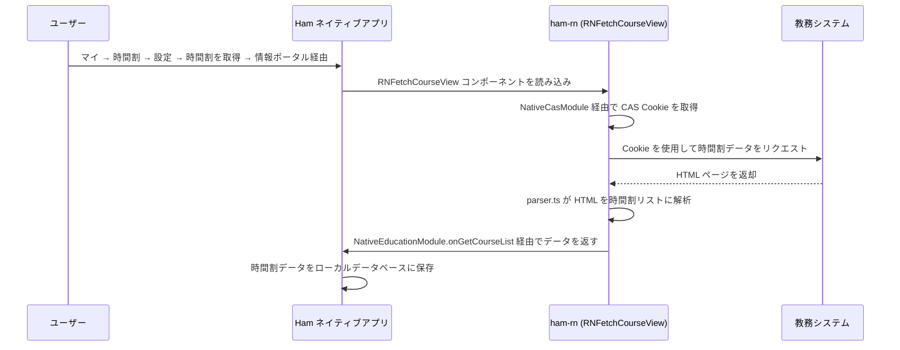
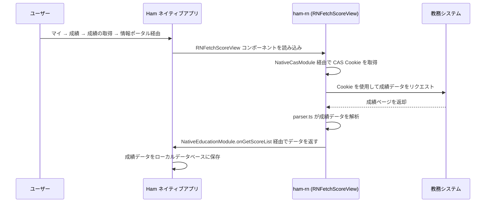

# 教務モジュール

教務モジュールは Ham React Nativeコンポーネントのコアビジネスモジュールで、大学の教務システムから時間割と成績データを取得します。

## 時間割照会

### ユーザー操作入口

**マイ → 時間割 → 設定 → 時間割を取得 → 情報ポータル経由**

ユーザーは「マイ」ページから時間割に入り、設定から「時間割を取得」を選択し、「情報ポータル経由」を選ぶと、CAS 経由で教務システムにログインし、時間割データが自動的に取得されます。

### 機能説明

時間割照会モジュールは教務システムから時間割データを取得・解析し、HTML ページを構造化された授業情報に変換します。

### 登録エントリー

| 登録名 | タイプ | 説明 |
| --- | --- | --- |
| `RNFetchCourseView` | コンポーネント | 時間割照会ビュー |

### コード構成

**ビジネスロジック (`business/education/course`)**

- `api.ts` — 時間割データリクエスト API、教務システムへの HTTP リクエストを送信
- `parser.ts` — HTML レスポンスパーサー、教務システムのページを構造化データに変換
- `color.ts` — 授業カラー割り当てロジック、異なる授業に異なる表示色を割り当て
- `type.ts` — 型定義（`CourseEntity`、`CourseGridEntity`）

**UI コンポーネント (`components/education/course`)**

- `FetchCourseView.tsx` — 時間割取得ビュー、取得の進捗と結果を表示

### ワークフロー

---

## 成績照会

### ユーザー操作入口

**マイ → 成績 → 成績の取得 → 情報ポータル経由**

ユーザーは「マイ」ページから成績に入り、「成績の取得」をタップし、「情報ポータル経由」を選ぶと、CAS 経由で教務システムにログインし、成績データが自動的に取得されます。

### 機能説明

成績照会モジュールは教務システムから学生の成績データを取得します。科目名、単位、成績、教員などの情報が含まれます。

### 登録エントリー

| 登録名 | タイプ | 説明 |
| --- | --- | --- |
| `RNFetchScoreView` | コンポーネント | 成績照会ビュー |

### コード構成

**ビジネスロジック (`business/education/score`)**

- `api.ts` — 成績データリクエスト API およびユーザー情報取得
- `parser.ts` — 成績データパーサー
- `type.ts` — 型定義（`ScoreEntity`、`ScoreRequestUserInfo`）

**UI コンポーネント (`components/education/score`)**

- `FetchScoreView.tsx` — 成績取得ビュー、取得の進捗と結果を表示

### ワークフロー

---

## 呼び出し可能モジュール

### 機能説明

`RNEducationCallable` は `BatchedBridge.registerCallableModule` を通じて登録された呼び出し可能モジュールです。通常のコンポーネントとは異なり、ネイティブ側は UI コンポーネントをレンダリングせずに直接メソッドを呼び出すことができます。

### 登録エントリー

| 登録名 | タイプ | 説明 |
| --- | --- | --- |
| `RNEducationCallable` | 呼び出し可能モジュール | 教務データ取得 |

### 提供メソッド

- `updateCourseList(year, semester)` — 教務システムにログインし、指定された学年・学期の時間割リストを取得、`NativeEducationModule.onGetCourseList` コールバックで結果を返す
- `updateScoreList()` — 教務システムにログインし、成績リストを取得、`NativeEducationModule.onGetScoreList` コールバックで結果を返す

---

## 関連ネイティブモジュール

| モジュール | 説明 |
| --- | --- |
| `NativeCasModule` | 保存済み CAS Cookie のリクエスト（教務システムログイン用） |
| `NativeEducationModule` | 教務データコールバック（時間割リスト、成績リスト、学期設定） |
