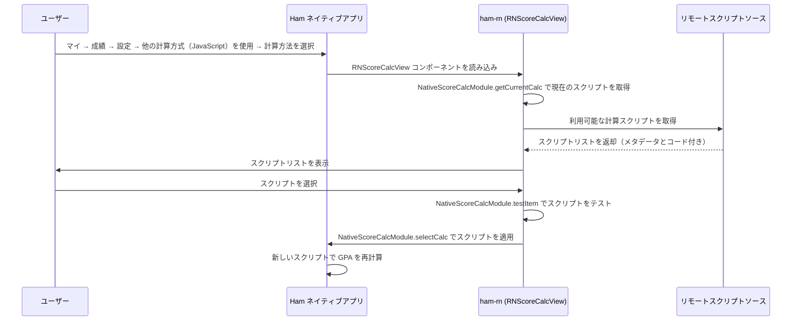

# GPA 計算モジュール

## ユーザー操作入口

**マイ → 成績 → 設定 → F2計算方法 → 他の計算方式（JavaScript）を使用 → 計算方法を選択**

ユーザーは「マイ」ページから成績に入り、設定をタップし、「F2計算方法」で「他の計算方式（JavaScript）を使用」を選択し、「計算方法を選択」をタップすると、GPA 計算スクリプト選択ページに移動します。このページは Ham React Nativeコンポーネントによってレンダリングされます。

## 機能説明

GPA 計算モジュールは JavaScript ベースのカスタム GPA / 加重成績計算機能を提供します。ユーザーは以下のことができます：

1. 利用可能な計算スクリプトの一覧を閲覧（GitHub などのソースから）
2. 計算スクリプトを選択して適用
3. スクリプトの詳細を確認（作者、バージョン、更新説明など）
4. スクリプトが正常に動作するかテスト

## 登録エントリー

| 登録名 | タイプ | 説明 |
| --- | --- | --- |
| `RNScoreCalcView` | コンポーネント | GPA 計算スクリプト選択ビュー |

## コード構成

### ビジネスロジック (`business/education/scorecalc`)

- `fetch.ts` — リモートから利用可能な計算スクリプトリストを取得
- `type.ts` — 型定義（計算スクリプトのメタデータ構造）

### UI コンポーネント (`components/scorecalc`)

- `ScoreCalcView.tsx` — GPA 計算メインビュー、以下のサブコンポーネントを含む：
  - 現在のスコアカード — 現在選択されている計算方法を表示
  - 説明セル — スクリプトの説明と更新情報を表示
  - 開発者カード — スクリプト作者情報を表示
  - GitHub リンクカード — スクリプトの GitHub リポジトリへのリンク

## ワークフロー



## 計算スクリプトの形式

計算スクリプトは JavaScript 関数で、成績リスト JSON 文字列とユーザー情報 JSON 文字列を受け取り、配列を返します：

```javascript
/**
 * @param {string} scoreListJson - 成績リスト JSON 文字列
 * @param {string} userInfoJson - ユーザー情報 JSON 文字列
 * @returns {[number, string[]]} - [計算結果, 選択された科目IDリスト]
 */
function calc(scoreListJson, userInfoJson) {
    const scoreList = JSON.parse(scoreListJson);
    const userInfo = JSON.parse(userInfoJson);
    // カスタム計算ロジック
    return [score, selectedCourseIds];
}
```

## 新しい計算方法の追加方法

### ステップ 1：計算スクリプトの作成

`src/business/education/scorecalc/embed/` ディレクトリに新しい `.ts` ファイルを作成し、`defineEmbed` 関数を使って計算ロジックを定義します：

```typescript
import {defineEmbed} from '@/business/education/scorecalc/defineEmbed';

defineEmbed((scoreList, userInfo) => {
  // scoreList: ScoreJsItem[] — 成績リスト
  // userInfo: UserInfo — ユーザー情報

  // ここに計算ロジックを記述
  let totalWeighted = 0;
  let totalCredit = 0;
  const selectedIds: string[] = [];

  for (const item of scoreList) {
    totalWeighted += item.credit * item.score;
    totalCredit += item.credit;
    selectedIds.push(item.courseId);
  }

  const result = totalCredit > 0 ? totalWeighted / totalCredit : 0;

  // [計算結果, 計算に使用した科目IDリスト] を返す
  return [result, selectedIds];
});
```

### ステップ 2：利用可能なフィールド

`scoreList` の各要素（`ScoreJsItem`）には以下のフィールドがあります：

| フィールド | 型 | 説明 |
| --- | --- | --- |
| `courseType` | `string` | 科目カテゴリ（例："公共基础必修"） |
| `name` | `string` | 科目名（例："高等数学"） |
| `credit` | `number` | 単位数 |
| `courseCollege` | `string` | 開講学部 |
| `instructor` | `string` | 担当教員 |
| `score` | `number` | 成績（数値） |
| `courseId` | `string` | 科目の一意識別子 |

`userInfo`（`UserInfo`）には以下のフィールドがあります：

| フィールド | 型 | 説明 |
| --- | --- | --- |
| `userCollege` | `string` | ユーザーの所属学部（例："计算机学院"） |

### ステップ 3：スクリプトの登録

`src/business/education/scorecalc/fetch.ts` の `fetchScoreCalcFromLocal` 関数に新しいエントリを追加します：

```typescript
import newScript from './embed/generated/your-script.generated';

const fetchScoreCalcFromLocal = (): Array<ScoreCalcItem> => {
  return [
    // ... 既存のエントリ
    {
      title: '計算方法の名前',
      date: '2026-01-01',
      author: '作者名',
      version: 1,
      brief: '簡単な説明',
      updateBrief: '更新説明',
      desc: '詳細な説明',
      type: 'APP',
      url: 'https://raw.githubusercontent.com/whu-ham/ham-rn/main/src/business/education/scorecalc/embed/your-script.ts',
      script: newScript,
    },
  ];
};
```

### 注意事項

- `defineEmbed` は計算関数を `globalThis.calc` に登録し、ネイティブ側の JSContext（例：iOS JavaScriptCore）から呼び出し可能にします。
- 戻り値は `[number, string[]]` 形式でなければなりません。最初の要素は計算結果、2番目の要素は計算に使用した科目IDのリストです。
- `embed/` ディレクトリ内の `.ts` ファイルはビルド時に対応する `.generated` ファイルにコンパイルされ、`fetch.ts` からインポートされます。
- `courseType` フィールドで必修/選択科目をフィルタリングしたり、`userCollege` を使って学部固有の計算ロジックを実装できます。

## 関連ネイティブモジュール

| モジュール | 説明 |
| --- | --- |
| `NativeScoreCalcModule` | GPA 計算スクリプト管理（現在のスクリプト取得 / 選択 / 詳細表示 / テスト） |
