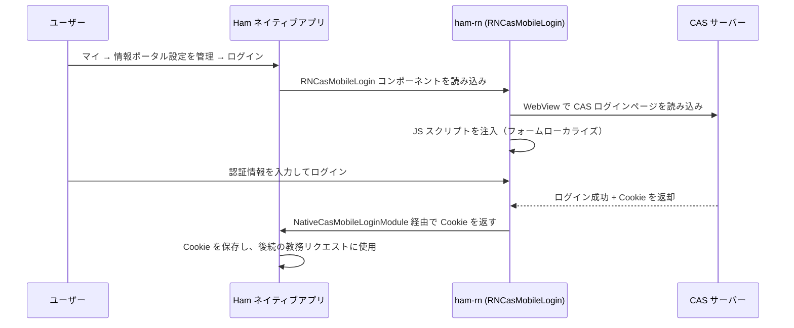

# CAS 認証モジュール

## ユーザー操作入口

Ham アプリで以下の操作で CAS ログインを行います：

**マイ → 情報ポータル設定を管理 → ログイン**

教務関連機能（時間割照会、成績照会など）を初めて使用する際、情報ポータルにログインしていない場合、アプリが CAS ログインページへ案内します。

## 機能説明

CAS（Central Authentication Service）は大学の統一認証システムです。ham-rn の CAS モジュールは以下を担当します：

1. WebView を通じて大学の CAS ログインページを読み込み
2. カスタム JavaScript スクリプトを注入し、ログインフォームのローカライズ（多言語対応）を実現
3. ログイン成功後の Cookie をインターセプト
4. Cookie をネイティブ側に返し、後続の教務システムリクエストに使用

## 登録エントリー

| 登録名 | タイプ | 説明 |
| --- | --- | --- |
| `RNCasMobileLogin` | コンポーネント | CAS モバイルログインビュー |

## コード構成

### ビジネスロジック (`business/cas`)

- `api.ts` — CAS 認証 API ラッパー、CAS サーバーとの HTTP 通信を処理
- `index.ts` — モジュールエクスポート

### UI コンポーネント (`components/cas`)

- `CasMobileLoginView.tsx` — CAS モバイルログインインターフェース、WebView ベース

## ワークフロー

## 関連ネイティブモジュール

| モジュール | 説明 |
| --- | --- |
| `NativeCasModule` | 保存済み CAS Cookie のリクエスト |
| `NativeCasMobileLoginModule` | ログイン成功コールバックの受信（学籍番号、パスワード、Cookie） |
