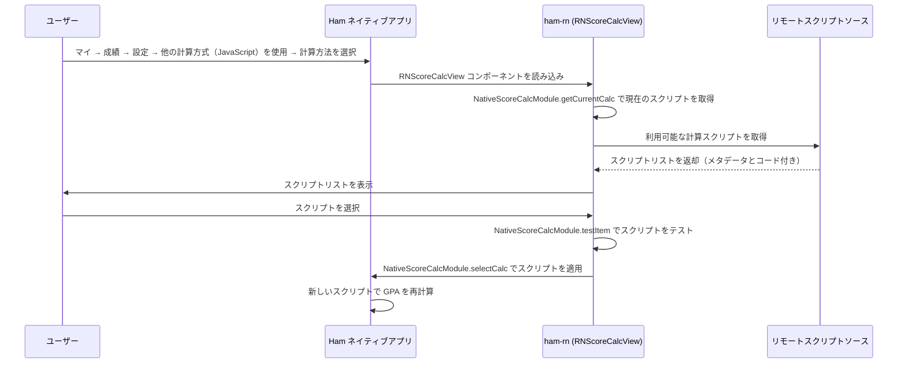

# GPA 計算モジュール

## ユーザー操作入口

**マイ → 成績 → 設定 → F2計算方法 → 他の計算方式（JavaScript）を使用 → 計算方法を選択**

ユーザーは「マイ」ページから成績に入り、設定をタップし、「F2計算方法」で「他の計算方式（JavaScript）を使用」を選択し、「計算方法を選択」をタップすると、GPA 計算スクリプト選択ページに移動します。このページは ham-rn によってレンダリングされます。

## 機能説明

GPA 計算モジュールは JavaScript ベースのカスタム GPA / 加重成績計算機能を提供します。ユーザーは以下のことができます：

1. 利用可能な計算スクリプトの一覧を閲覧（GitHub などのソースから）
2. 計算スクリプトを選択して適用
3. スクリプトの詳細を確認（作者、バージョン、更新説明など）
4. スクリプトが正常に動作するかテスト

## 登録エントリー

| 登録名 | タイプ | 説明 |
| --- | --- | --- |
| `RNScoreCalcView` | コンポーネント | GPA 計算スクリプト選択ビュー |

## コード構成

### ビジネスロジック (`business/education/scorecalc`)

- `fetch.ts` — リモートから利用可能な計算スクリプトリストを取得
- `type.ts` — 型定義（計算スクリプトのメタデータ構造）

### UI コンポーネント (`components/scorecalc`)

- `ScoreCalcView.tsx` — GPA 計算メインビュー、以下のサブコンポーネントを含む：
  - 現在のスコアカード — 現在選択されている計算方法を表示
  - 説明セル — スクリプトの説明と更新情報を表示
  - 開発者カード — スクリプト作者情報を表示
  - GitHub リンクカード — スクリプトの GitHub リポジトリへのリンク

## ワークフロー



## 計算スクリプトの形式

計算スクリプトは JavaScript 関数で、成績リスト JSON 文字列とユーザー情報 JSON 文字列を受け取り、配列を返します：

```javascript
/**
 * @param {string} scoreListJson - 成績リスト JSON 文字列
 * @param {string} userInfoJson - ユーザー情報 JSON 文字列
 * @returns {[number, string[]]} - [計算結果, 選択された科目IDリスト]
 */
function calc(scoreListJson, userInfoJson) {
    const scoreList = JSON.parse(scoreListJson);
    const userInfo = JSON.parse(userInfoJson);
    // カスタム計算ロジック
    return [score, selectedCourseIds];
}
```

## 関連ネイティブモジュール

| モジュール | 説明 |
| --- | --- |
| `NativeScoreCalcModule` | GPA 計算スクリプト管理（現在のスクリプト取得 / 選択 / 詳細表示 / テスト） |
