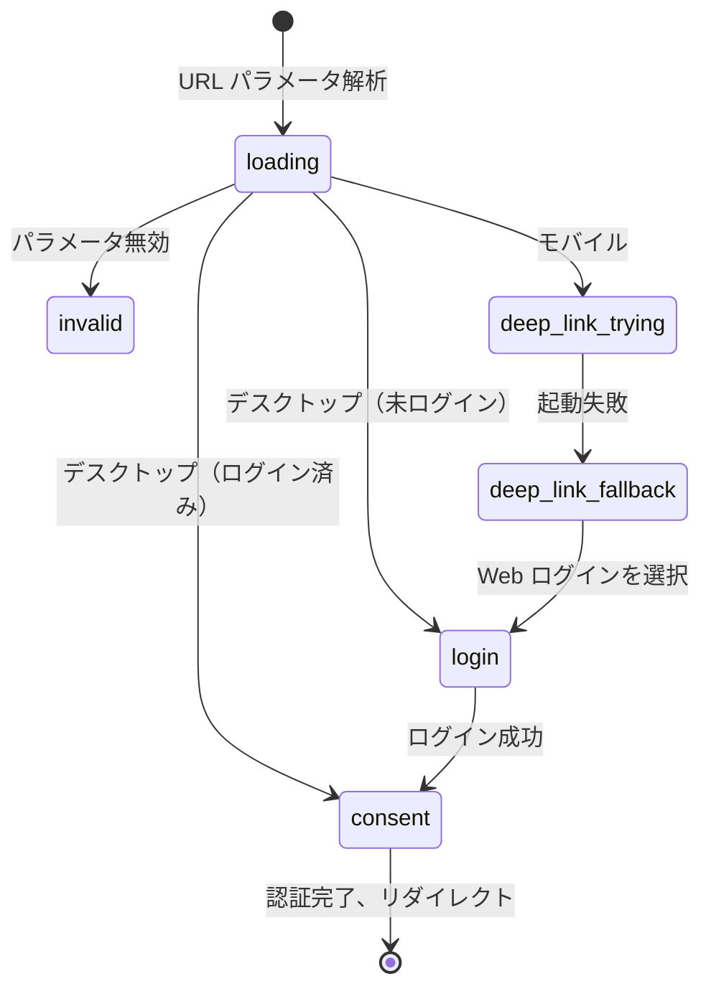
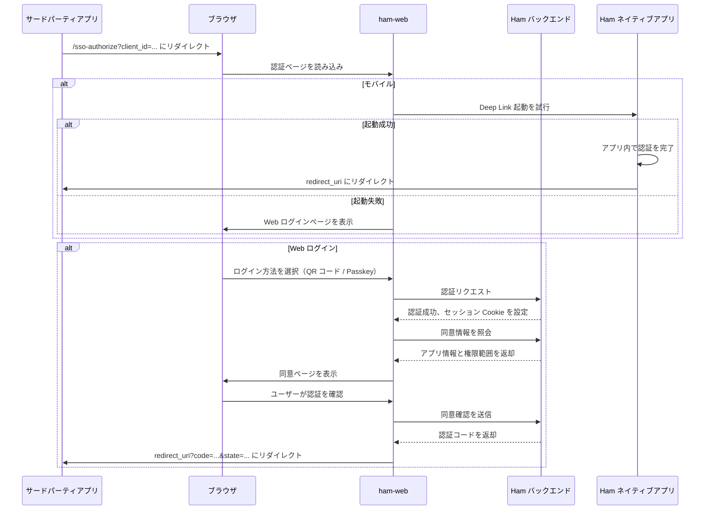

# SSO OAuth2 認証

## ユーザー操作入口

サードパーティアプリが Ham Connect プラットフォームを通じて OAuth2 認証を開始すると、ユーザーは ham-web の `/sso-authorize` ページにリダイレクトされます。

ページの動作はユーザーのデバイスとログイン状態によって異なります：

- **モバイル**：まず `ham://sso-authorize?...` Deep Link で Ham ネイティブアプリの起動を試みます。起動に失敗した場合は Web ログインにフォールバックします
- **デスクトップ**：Web ログインページを直接表示します

## 機能説明

SSO OAuth2 認証ページは以下のフローを処理します：

1. URL パラメータの解析（`client_id`、`scope`、`redirect_uri`、`state`）
2. デバイスタイプの検出（モバイル / デスクトップ）
3. モバイルでの Deep Link 起動試行
4. Web ログインが必要な場合、以下のログイン方法を提供：
   - **QR コードログイン** — Ham アプリでスキャンしてログイン
   - **Passkey ログイン** — WebAuthn / Passkey パスワードレスログイン
5. ログイン成功後、同意確認ページを表示（サードパーティアプリ情報とリクエストされた権限範囲）
6. ユーザーが確認後、認証コード付きでサードパーティアプリの `redirect_uri` にリダイレクト

## ページステージ

ページは Jotai 状態管理を使用し、以下のステージで遷移します：

| ステージ | 説明 |
| --- | --- |
| `loading` | URL パラメータの解析、デバイスタイプの検出 |
| `invalid` | URL パラメータが無効、エラーページを表示 |
| `deep-link-trying` | Ham ネイティブアプリの起動を試行中 |
| `deep-link-fallback` | 起動失敗、アプリインストールリンクと Web ログインオプションを提供 |
| `login` | Web ログインページ（QR コード / Passkey） |
| `consent` | 認証同意ページ |

## コード構成

### ページコンポーネント (`app/sso-authorize/`)

- `page.client.tsx` — メインページコンポーネント、ステージ遷移と Deep Link ロジックを担当
- `store.ts` — Jotai 状態アトム（URL パラメータ、ページステージ、Deep Link URL）
- `LoginView.tsx` — ログインビュー（QR コード + Passkey タブ）
- `ConsentView.tsx` — 認証同意ビュー
- `DeepLinkTrying.tsx` — Deep Link 試行中ビュー
- `DeepLinkFallback.tsx` — Deep Link フォールバックビュー
- `HeaderBar.tsx` — ページヘッダーバー
- `InvalidRequestView.tsx` — 無効リクエストビュー

### サービス層 (`services/sso/`)

- `api.ts` — SSO API ラッパー（QR ログイン、Passkey ログイン、セッション管理、同意）
- `deepLink.ts` — Deep Link 構築と起動ロジック
- `ua.ts` — デバイスタイプ検出（モバイル / デスクトップ）

### API ルート (`app/api/`)

- `auth/qr/ticket/` — QR ログインチケットの作成とポーリング
- `auth/passkey/` — Passkey ログイン（オプション取得、アサーション検証）
- `auth/me/` — 現在のログインユーザー情報を取得
- `auth/logout/` — ログアウト
- `auth/refresh/` — セッションリフレッシュ
- `sso/consent/info/` — 同意情報の取得（サードパーティアプリ名、権限範囲の説明）
- `sso/consent/confirm/` — 認証確認、認証コードを返却

## ワークフロー

## セッション管理

認証ページは可視性を考慮したセッションリフレッシュメカニズムを実装しています：

- 同意ステージにある間、`visibilitychange` イベントを監視
- ページがバックグラウンドからフォアグラウンドに復帰するたびに、`/auth/refresh` を呼び出してセッション Cookie を更新
- セッションが期限切れ（401）の場合、自動的にユーザーをログインステージに戻す
