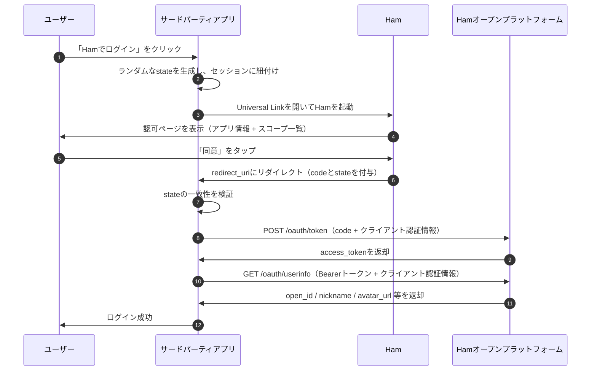

# Ham Connect

Ham Connectは、Hamオープンプラットフォームが提供するOAuth 2.0認可サービスで、サードパーティアプリケーションがHamユーザーの認可情報を安全に取得できるようにします。

## 概要

Ham Connectは標準の **OAuth 2.0 Authorization Code Grant**（RFC 6749 §4.1）に基づいて実装されています。サードパーティアプリケーションはHam Connectを通じて「Hamでログイン」機能を実装し、ユーザーの認可後に基本情報を取得できます。

### 対応スコープ

| スコープ | 説明 | 返却フィールド |
|---|---|---|
| `profile` | ユーザーのニックネームとアバターにアクセス | `nickname`、`avatar_url` |
| `is_student` | ユーザーが学生かどうかにアクセス | `is_student`（bool） |

> `open_id`（現在のアプリケーションにおけるユーザーの一意識別子）は常に返却され、追加のスコープは不要です。

## OAuth2 インタラクションフロー

### フロー説明

1. **認可の開始**：サードパーティアプリがUniversal Link経由でHamを起動し、`client_id`、`scope`、`state`、`redirect_uri`パラメータを送信
2. **ユーザー認可**：ユーザーがHamで認可情報を確認し、同意
3. **認可コードの取得**：Hamがサードパーティアプリの`redirect_uri`にリダイレクトし、ワンタイム`code`を付与
4. **トークン交換**：サードパーティの**サーバー**が`code` + `client_id` + `client_secret`で`access_token`を取得
5. **ユーザー情報の取得**：サードパーティの**サーバー**が`access_token` + クライアント認証情報でユーザー情報をリクエスト

### 主要エンドポイント

| エンドポイント | 説明 |
|---|---|
| `https://ham.nowcent.cn/sso-authorize` | 認可エントリ（Universal Link）、モバイル、デスクトップ（QRコードスキャン等）、Passkey認証に対応 |
| `https://open-api.ham.nowcent.cn/oauth/token` | トークン交換 |
| `https://open-api.ham.nowcent.cn/oauth/userinfo` | ユーザー情報の取得 |

### トークンの有効期間

| トークン | 有効期間 | 備考 |
|---|---|---|
| Authorization Code | 5分 | ワンタイム使用、交換後に無効化 |
| Access Token | 2時間 | 期限切れ後は再認可が必要 |
| Refresh Token | 提供なし | — |

## client_id と client_secret の取得

`client_id`と`client_secret`は、Ham Connectに接続するために必要な認証情報です：

- **client_id**：アプリケーションの公開識別子、フロントエンドで使用可能
- **client_secret**：アプリケーションの機密認証情報、**サーバーサイドでのみ使用**してください。フロントエンドコード、モバイルアプリバンドル、公開リポジトリには絶対に含めないでください

::: warning 申請方法
現在、`client_id`と`client_secret`は開発者に連絡して申請する必要があります。

[GitHub Discussions](https://github.com/whu-ham/whu-ham.github.io/discussions)からお問い合わせいただき、以下の情報をご提供ください：

1. アプリケーション名と概要
2. コールバックURL（`redirect_uri`）ホワイトリスト
3. 必要なスコープ
:::

## セキュリティに関する注意事項

- すべてのAPI呼び出しは**HTTPS**を使用すること
- `client_secret`と`access_token`は**サーバーサイドでのみ保存・使用**すること
- CSRF攻撃を防ぐため、`state`パラメータを常に使用・検証すること
- **最小権限の原則**に従い、業務に必要なスコープのみを申請すること
- ユーザーの一意識別子として`open_id`を使用し、`nickname`に依存しないこと

::: tip 完全なドキュメント
完全なAPI仕様、エラーコード、セキュリティベストプラクティスについては、[接続ガイド](./oauth2-guide)をご参照ください。
:::
