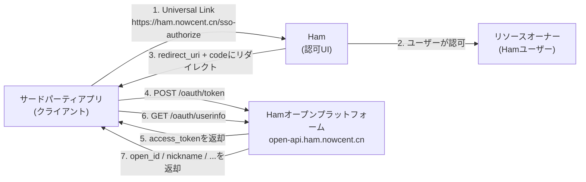
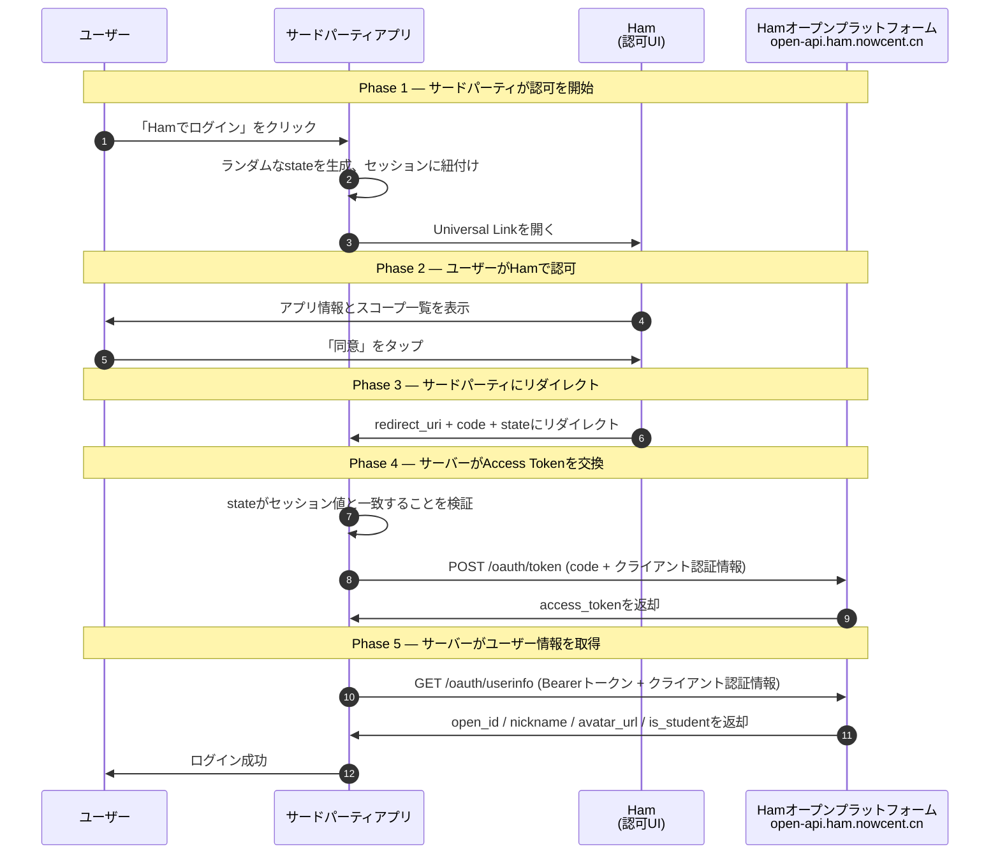

# OAuth 2.0 完全接続ガイド

> 本ドキュメントは、**Hamオープンプラットフォーム**に接続を希望するサードパーティアプリケーション開発者向けです。HamがOAuth 2.0 Authorization Code Grant（RFC 6749 §4.1）に基づいて実装したSSO認可フロー、API仕様、接続の詳細、およびセキュリティベストプラクティスを体系的に紹介します。
>
> - **オープンプラットフォームAPIドメイン**：`https://open-api.ham.nowcent.cn`（すべてのサーバー間HTTP呼び出しはこのドメインを使用、HTTPS必須）
> - **認可エントリ（Universal Link）**：`https://ham.nowcent.cn/sso-authorize?client_id=xxx&scope=profile,is_student&state=yyy&redirect_uri={redirect_uri}`

## 1. 基本概念と役割定義

Hamオープンプラットフォームは標準の **OAuth 2.0 Authorization Code Grant**（RFC 6749 §4.1）を実装しています。Hamの認可確認UIはモバイルネイティブ認可、デスクトップQRコードスキャン、Passkey認証など複数の方式に対応しており、フロー全体に4つの役割が存在します。

### 1.1 4つの役割

| 役割 | 担当 | 責務 |
|---|---|---|
| **リソースオーナー** | Hamログインユーザー | 保護されたリソース（個人情報、学生身分等）を所有。サードパーティアプリへのアクセスを認可するかどうかを決定 |
| **クライアント** | サードパーティアプリ（Web / App / サーバー） | **本ドキュメントの対象**。認可リクエストの発行、`code`の受信、サーバーサイドでの`access_token`取得、UserInfo APIの呼び出し |
| **認可UI** | Ham | サードパーティからのDeep Linkを受信し、認可同意ページを表示。モバイルネイティブ認可、デスクトップQRコードスキャン、Passkey認証に対応 |
| **認可/リソースサーバー** | Hamバックエンド（`open-api.ham.nowcent.cn`） | 認可コード・Access Tokenの発行、サードパーティ認証情報の検証、scopeに基づくユーザーリソースの返却 |

**役割間の相互作用（サードパーティ視点）：**



### 1.2 主要用語

| 用語 | 説明 |
|---|---|
| **Client ID**（`client_id`） | Hamオープンプラットフォーム登録後に取得する**公開識別子** |
| **Client Secret**（`client_secret`） | 登録後に取得する**機密認証情報**。**サーバーサイドのみ**で保持し、フロントエンドコード、モバイルバンドル、公開リポジトリには絶対に含めない |
| **Redirect URI** | 認可完了後にHamがリダイレクトするアドレス。Hamオープンプラットフォームコンソールで**ホワイトリスト登録**が必要。**完全文字列一致**で検証 |
| **Authorization Code**（`code`） | Access Token取得用のワンタイム・短期有効な中間認証情報。有効期間**5分** |
| **Access Token** | ユーザー情報アクセス用のBearerトークン。有効期間**2時間**。Refresh Tokenなし（期限切れ後は再認可が必要） |
| **Scope** | 認可範囲、[1.3](#_1-3-スコープ権限)を参照 |
| **State** | クライアントが生成する予測不可能なランダム文字列。CSRF攻撃防止用。リダイレクトURLでそのまま返却 |
| **open_id** | 現在のサードパーティアプリにおけるユーザーの安定した一意識別子。**決定的**（同一ユーザー＋同一アプリ＝常に同じ）、**不可逆**、**アプリ間で異なる** |

### 1.3 スコープ権限

Hamオープンプラットフォームが現在サポートするスコープ。**最小権限の原則**に従い、業務に必要な権限のみを申請してください：

| スコープ | 説明 | UserInfo返却フィールド |
|---|---|---|
| `profile` | ニックネームとアバターにアクセス | `nickname`、`avatar_url` |
| `is_student` | 学生かどうかにアクセス | `is_student`（bool） |

> **注意**：リストにないスコープはサーバーで静かにフィルタリングされます。`open_id`は常に返却され、追加のスコープは不要です。

## 2. 認可コードフローの詳細

### 2.1 シーケンス図



### 2.2 ステップごとの説明

**Phase 1 — サードパーティが認可を開始**

1. ユーザーがサードパーティアプリで「Hamでログイン」をクリック。
2. サードパーティアプリが**自身のサーバーで**生成：
   - `state`：予測不可能なランダム文字列（推奨 ≥ 32バイトのエントロピー）、現在のユーザーセッションに紐付けて保存（Session / Redis）。
   - 使用する`redirect_uri`を選択：Hamオープンプラットフォームコンソールに登録済みのホワイトリストアドレスの1つ、HTTPSのみ。
3. サードパーティアプリがUniversal Link経由でHamを起動：

   ```
   https://ham.nowcent.cn/sso-authorize?client_id=xxx&scope=profile,is_student&state=yyy&redirect_uri={redirect_uri}
   ```

**Phase 2 — ユーザーがHamで認可**

4. Hamはユーザーのログインを要求し、サードパーティアプリ名、アイコン、リクエストされたスコープ一覧を表示。
5. ユーザーがHamで「同意」をタップ。同一アプリの同一スコープを以前に認可済みの場合、Hamは同意ページをスキップ可能。

**Phase 3 — サードパーティにリダイレクト**

6. Hamバックエンドが`redirect_uri`がアプリの**ホワイトリスト**内にあることを検証。成功後、Hamがそのアドレスを開き、クエリパラメータに`code`と元の`state`を付与：

   ```
   {redirect_uri}?code={code}&state={state}
   ```

**Phase 4 — サーバーがAccess Tokenを交換**

7. サードパーティアプリが`redirect_uri`で`code`と`state`を受信：
   - **必ず**`state`がセッション値と厳密に一致することを検証；
   - `code`を直ちに自身のサーバーに送信。
8. サードパーティ**サーバー**が`https://open-api.ham.nowcent.cn/oauth/token`にPOSTリクエストを送信し、クライアント認証情報でAccess Tokenを交換。

**Phase 5 — サーバーがユーザー情報を取得**

9. サードパーティ**サーバー**が`Bearer {access_token}` + クライアント認証情報で`https://open-api.ham.nowcent.cn/oauth/userinfo`をリクエスト。
10. サードパーティが`open_id`をユーザー一意識別子として使用し、ログイン/紐付けなどのビジネスロジックを完了。

## 3. コア操作の説明

### 3.1 認可リクエストの構築（Hamの起動）

**Universal Linkフォーマット：**

```
https://ham.nowcent.cn/sso-authorize?client_id={client_id}&scope={scopes}&state={state}&redirect_uri={redirect_uri}
```

**パラメータ：**

| パラメータ | 必須 | 説明 |
|---|---|---|
| `client_id` | 必須 | 登録時に取得したClient ID |
| `scope` | 必須 | カンマ区切り、例：`profile,is_student` |
| `state` | **強く推奨** | CSRF防御用ランダム文字列、ユーザーセッションに紐付け |
| `redirect_uri` | **必須** | 認可成功後のリダイレクト先。コンソールで**ホワイトリスト登録**済みであること。クエリ文字列に含める際は**パーセントエンコーディング**が必要 |

**Web例：**

```html
<a href="https://ham.nowcent.cn/sso-authorize?client_id=abc123&scope=profile,is_student&state=xY7Kq9fZ2pLmN8vB&redirect_uri=https%3A%2F%2Fyour-app.example.com%2Fcallback">
  Hamでログイン
</a>
```

**JS例：**

```js
const state = crypto.randomUUID();
sessionStorage.setItem('ham_oauth_state', state);
const redirectUri = 'https://your-app.example.com/callback';
const params = new URLSearchParams({
  client_id: 'abc123',
  scope: 'profile,is_student',
  state,
  redirect_uri: redirectUri,
});
location.href = `https://ham.nowcent.cn/sso-authorize?${params.toString()}`;
```

### 3.2 認可コールバックの処理

**成功リダイレクト：**

```
https://your-app.example.com/callback?code=SplxlOBeZQQYbYS6WxSbIA&state=xY7Kq9fZ2pLmN8vB
```

**ユーザーキャンセル/認可失敗**：Hamはリダイレクトしません。サードパーティは「再試行」ログインエントリを保持すべきです。

**クライアント処理のポイント：**

1. まず`state`がセッション値と**厳密に一致**することを検証。一致しない場合は終了しエラーを表示；
2. 検証後のみ、`code`を直ちにサーバーに送信してトークン交換；
3. `code`をフロントエンドログ、URLブックマーク、Referrer、フロントエンドストレージに**保存しない**。

### 3.3 トークン交換（Code → Access Token）

**エンドポイント：**

```
POST https://open-api.ham.nowcent.cn/oauth/token
```

**リクエストヘッダー：**

```
Content-Type: application/x-www-form-urlencoded
Authorization: Basic {BASE64(client_id:client_secret)}
```

**リクエストボディ：**

| パラメータ | 必須 | 説明 |
|---|---|---|
| `grant_type` | はい | `authorization_code`固定 |
| `code` | はい | Phase 3で取得した認可コード |
| `client_id` | 条件付き | Basic Auth未使用時に必須 |
| `client_secret` | 条件付き | Basic Auth未使用時に必須 |

**成功レスポンス（200 OK）：**

```json
{
  "access_token": "a1b2c3d4e5f6...",
  "token_type": "Bearer",
  "expires_in": 7200,
  "scope": "profile is_student"
}
```

**エラーレスポンス：**

```json
{
  "error": "invalid_grant",
  "error_description": "The authorization code is invalid or expired"
}
```

**cURL例：**

```bash
curl -X POST https://open-api.ham.nowcent.cn/oauth/token \
  -u "abc123:your_client_secret" \
  -H "Content-Type: application/x-www-form-urlencoded" \
  -d "grant_type=authorization_code&code=SplxlOBeZQQYbYS6WxSbIA"
```

### 3.4 ユーザー情報へのアクセス（UserInfo）

**エンドポイント：**

```
GET https://open-api.ham.nowcent.cn/oauth/userinfo
```

**リクエストヘッダー：**

```
Authorization: Bearer {access_token}
```

> **注意**：UserInfoエンドポイントはAccess Tokenとクライアント認証情報の**両方**が必要です（二要素検証）。

**成功レスポンス（200 OK）：**

```json
{
  "open_id": "3f7a9c2b...e8",
  "nickname": "太郎",
  "avatar_url": "https://cdn.ham.nowcent.cn/avatar/xxx.jpg",
  "is_student": true,
  "scope": "profile is_student"
}
```

**フィールド説明：**

| フィールド | 説明 | 返却条件 |
|---|---|---|
| `open_id` | 現在のアプリにおけるユーザーの安定した一意識別子 | 常に返却 |
| `nickname` | ユーザーニックネーム | `profile`が付与された場合 |
| `avatar_url` | ユーザーアバターURL | `profile`が付与された場合 |
| `is_student` | 学生かどうか | `is_student`が付与された場合 |
| `scope` | 実際に付与されたスコープ（スペース区切り） | 常に返却 |

**cURL例：**

```bash
curl https://open-api.ham.nowcent.cn/oauth/userinfo \
  -u "abc123:your_client_secret" \
  -H "Authorization: Bearer a1b2c3d4e5f6..."
```

### 3.5 トークンの種類と有効期間

| トークン | 有効期間 | 備考 |
|---|---|---|
| `authorization_code` | 5分 | ワンタイム認証情報、交換後に無効化 |
| `access_token` | 2時間（`expires_in = 7200`） | Opaqueトークン — クライアントで解析を**試みない** |
| **Refresh Token** | 提供なし | Access Token期限切れ後は**再認可**が必要 |

## 4. セキュリティプラクティスと注意事項

### 4.1 セキュリティベストプラクティス

- すべてのHTTP呼び出しは**HTTPS**を使用、TLS 1.2+
- `client_secret`と`access_token`は**サーバーサイドのみ**で保存 — フロントエンドコード、モバイルバンドル、公開リポジトリには含めない
- `access_token`をブラウザに送信する必要がある場合は、**HttpOnly + Secure + SameSite=Lax/Strict** Cookieを使用
- CSRF防御のため`state`パラメータを**常に**使用・検証
- 「フロントエンドがDeep Linkを起動 → サーバーがTokenを交換 → サーバーがUserInfoを呼び出す」の分担を厳守
- スコープ申請は**最小権限の原則**に従う
- `open_id`を安定したユーザー識別子として使用

### 4.2 一般的なセキュリティリスク

| リスク | 攻撃方法 | 対策 |
|---|---|---|
| **CSRF** | 攻撃者が認可リンクを作成し被害者を誘導 | ランダムな`state`を強制し、コールバックで厳密に検証 |
| **コード傍受** | 悪意のあるアプリがURL Schemeでコールバックを乗っ取り | 事前登録済みのHTTPS `redirect_uri`を使用 |
| **`client_secret`漏洩** | secretがフロントエンドバンドルや公開リポジトリに含まれる | secretはサーバーサイドのみ；鍵管理を使用；定期的にローテーション |
| **トークン漏洩** | URL、Referrer、ログ経由で漏洩 | トークンはヘッダーのみ；ログをサニタイズ |
| **XSSトークン窃取** | フロントエンドスクリプトが`localStorage`からトークンを読み取り | HttpOnly Cookieを使用；厳格なCSP |

### 4.3 エラー処理

| HTTPステータス | エラー | トリガー | クライアントアクション |
|---|---|---|---|
| 400 | `unsupported_grant_type` | `grant_type`が`authorization_code`でない | リクエストパラメータを確認 |
| 400 | `invalid_request` | 必須パラメータの欠落 | パラメータを修正して再試行 |
| 400 | `invalid_grant` | `code`が無効/期限切れ/使用済み | ユーザーに再認可を案内 |
| 401 | `invalid_client` | クライアント認証情報エラー | クライアント認証情報を確認 |
| 401 | `invalid_token` | `access_token`が無効/期限切れ | ユーザーに再認可を案内 |
| 403 | `insufficient_scope` | トークンがこの`client_id`に付与されていない | 正しい認証情報を使用するか再認可 |
| 5xx | `server_error` | サーバーエラー | 指数バックオフで再試行 |

---

**参考仕様**

- RFC 6749 — The OAuth 2.0 Authorization Framework
- RFC 6750 — The OAuth 2.0 Authorization Framework: Bearer Token Usage
- RFC 9700 — Best Current Practice for OAuth 2.0 Security

**オープンソース**

HamのWebクライアントはGitHubでオープンソース公開されています：[whu-ham/ham-web](https://github.com/whu-ham/ham-web)。OAuth 2.0認可の実装を参考にできます。
